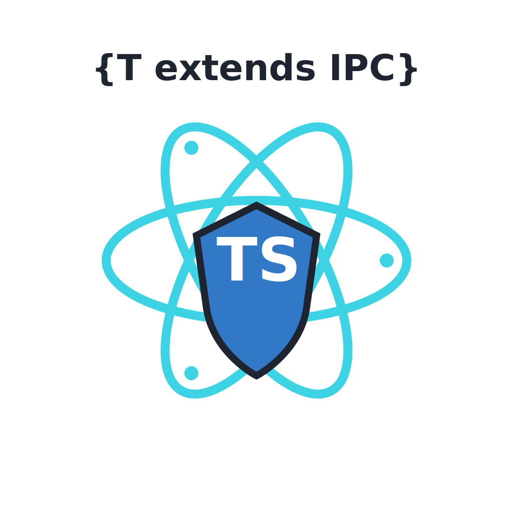

# Electron IPC Code Generator

<p align="center">
  
</p>

Type-safe IPC communication generator for Electron applications with streaming support.

## Overview

This monorepo contains a TypeScript code generator that creates type-safe IPC (Inter-Process Communication) APIs for Electron applications. It eliminates boilerplate code and ensures type safety across main, preload, and renderer processes.

**The Key Benefit:** When you change an IPC contract interface, TypeScript immediately shows compile errors everywhere the contract is used incorrectly - before you even run the code. No runtime surprises!

## 📦 Packages

### `packages/electron-ipc` (v2.6.0)

The main library - a TypeScript code generator that creates type-safe IPC communication code for Electron applications.

**Features:**

- ✅ Type-safe invoke/event/broadcast patterns
- ✅ Renderer-to-renderer IPC (multi-window communication)
- ✅ Stream support for large data transfers
- ✅ Automatic React hooks generation
- ✅ Modern validation adapters (Zod 4.x/Valibot)
- ✅ Runtime validation helpers with standardized error handling
- ✅ Error deserialization utilities for structured error handling
- ✅ Generator watch/check workflow for CI
- ✅ Templates + integration examples (electron-vite/forge)
- ✅ YAML-based configuration
- ✅ Koa-style IPC middleware for logging, auth, metrics, and error mapping
- ✅ Window management registry + multi-window broadcast helpers
- ✅ IPC Inspector for tracing and debugging (dev-only)
- ✅ Full Windows/macOS/Linux support

**Status:** Production ready

### `packages/create-electron-ipc` (v0.3.1)

Scaffold new Electron apps with type-safe IPC contracts pre-configured.

**Quick Start:**

```bash
# macOS/Linux
npm create @number10/electron-ipc

# Windows (use npx with forward-slash /)
npx @number10/create-electron-ipc

# pnpm (all platforms, use forward-slash /)
pnpm dlx @number10/create-electron-ipc
```

> **Windows Note:** Always use forward-slash `/` in the package name, not backslash `\`.

**Features:**

- ✅ Interactive CLI setup
- ✅ Electron + Vite + React template
- ✅ TypeScript configured with strict mode
- ✅ ESLint + Prettier setup
- ✅ Optional IPC Inspector
- ✅ Optional validation (Zod/Valibot)
- ✅ VS Code workspace settings
- ✅ Works with npm and pnpm
- ✅ npm metadata for public package discovery

**Status:** Beta - ready for testing

### `apps/test-app`

A full Electron application that serves as a test environment and reference implementation for the `electron-ipc` library.

## 🚀 Getting Started

### Prerequisites

- Node.js ≥20.19.0
- pnpm ≥8.0.0
- **Windows only:** Git Bash (for Git hooks)

> **Note for Windows users:** This project uses Husky for Git hooks. Git Bash must be installed and available in your PATH for the pre-commit hooks to work properly.

### Installation

```bash
# Install dependencies
pnpm install

# Build packages
pnpm run build

# Run tests
pnpm run test

# Start test app
pnpm run dev
```

### Working on Individual Packages

```bash
# electron-ipc library
cd packages/electron-ipc
pnpm run build
pnpm run watch

# test-app
cd apps/test-app
pnpm run dev
```

## 📁 Project Structure

```
electron-ipc/
├── packages/
│   ├── electron-ipc/        # Generator library (publishable)
│   │   ├── src/
│   │   │   ├── generator/   # Code generation logic
│   │   │   ├── interfaces/  # TypeScript interfaces
│   │   │   └── index.ts
│   ├── create-electron-ipc/ # Scaffold CLI (publishable)
│   └── template-basic/      # Internal template package
├── apps/
│   ├── test-app/            # Full internal reference app
│   ├── inspector-lab/       # Internal Inspector development app
│   ├── multi-window/        # Internal multi-window reference app
│   └── *-minimal/           # Internal bundler examples
├── docs-site/               # Public VitePress documentation site
├── docs/                    # Internal repository documentation
├── package.json             # Workspace root
└── tsconfig.json            # Base TypeScript config
```

## 🎯 Benefits

✅ **Five Communication Patterns** - Invoke (request-response), Events (fire-and-forget), Broadcasts (main → renderer), Renderer-to-renderer, Streams (large data/real-time)
✅ **Compile-Time Type Safety** - Change a contract interface → TypeScript shows errors immediately in all usages
✅ **No Runtime Surprises** - Catch signature mismatches before running the app
✅ **IntelliSense Everywhere** - Auto-completion in main, preload, and renderer processes
✅ **Refactoring Support** - Rename/change contracts → TypeScript guides you to fix all usages
✅ **Zero Boilerplate** - Auto-generated IPC wrappers and type definitions
✅ **Single Source of Truth** - IPC contracts defined once, validated everywhere

## 📚 Documentation

For detailed usage, API reference, and examples, see:

- [Public documentation site](https://electron-ipc.number10.de/)
- [`docs-site/`](docs-site/)
- [`docs/README.md`](docs/README.md)
- [`CHANGELOG.md`](CHANGELOG.md)

## 🛠 Technology Stack

- **TypeScript** - Strict mode, ES2022
- **Vite** - Build tool for library
- **electron-vite** - Build tool for Electron app
- **React** - UI framework for test app
- **Vitest** - Testing framework
- **ESLint** - Code linting (flat config)
- **Prettier** - Code formatting (no semicolons)
- **Husky** - Git hooks
- **ts-morph** - TypeScript AST manipulation

## 🤝 Contributing

1. Create feature branch
2. Make changes
3. Run `pnpm run lint` and `pnpm run test`
4. Commit with conventional commit format:
   - `feat:` new feature
   - `fix:` bug fix
   - `docs:` documentation
   - `refactor:` code refactoring
   - `test:` testing
   - `chore:` maintenance

## 📝 License

MIT
