# Architecture

## Code Generator Design

### Why Contract Helper Types?

The generator uses structured wrapper types (`GenericInvokeContract`, `IInvokeContract`, etc.) instead of simple function signatures for a critical reason: **reliable code generation**.

These helper types enforce a specific structure with named properties:

- `GenericInvokeContract<T>` + `IInvokeContract<Request, Response>` → `{ request: Request, response: Response }`
- `GenericRendererEventContract<T>` + `IRendererEventContract<Payload>` → `{ request: Payload }`
- `GenericBroadcastContract<T>` + `IBroadcastContract<Payload>` → `{ payload: Payload }`
- `GenericRendererInvokeContract<T>` + `IRendererInvokeContract<Request, Response>` → `{ request: Request, response: Response }`
- `GenericStreamInvokeContract<T>` + `IStreamInvokeContract<Request, Chunk>` → `{ request: Request, stream: Chunk }`
- `GenericStreamUploadContract<T>` + `IStreamUploadContract<Request, Chunk>` → `{ request: Request, data: Chunk }`
- `GenericStreamDownloadContract<T>` + `IStreamDownloadContract<Request, Chunk>` → `{ request: Request, data: Chunk }`

Structure overview:


**Why this is necessary:**

1. **Predictable AST Structure** - The generator can reliably parse TypeScript AST nodes
2. **Type Extraction** - Request/response types are consistently accessible
3. **No Ambiguity** - Cannot deviate from the pattern, ensuring generator compatibility
4. **Future-Proof** - Additional metadata can be added without breaking changes

Without these wrappers, the generator would have to handle countless variations of function signatures, making reliable type extraction impossible.

### Method Name Prefixes

The generator automatically adds prefixes to method names based on contract type:

| Contract Type   | Prefix         | Example                                       |
| --------------- | -------------- | --------------------------------------------- |
| Invoke          | `invoke`       | `AddNumbers` → `invokeAddNumbers()`           |
| Event           | `send`         | `Quit` → `sendQuit()`                         |
| Broadcast       | `on`           | `Ping` → `onPing(callback)`                   |
| Stream Invoke   | `invokeStream` | `GetLargeData` → `invokeStreamGetLargeData()` |
| Stream Upload   | `upload`       | `UploadFile` → `uploadUploadFile()`           |
| Stream Download | `download`     | `DownloadLogs` → `downloadDownloadLogs()`     |

**Benefits:**

- **Self-Documenting** - Method name reveals communication pattern
- **No Naming Conflicts** - Different contract types can use same base name
- **Consistent API** - Predictable naming across all generated methods

Example:

```typescript
// Contract definition
export type InvokeContracts = GenericInvokeContract<{
  GetUser: IInvokeContract<number, User>
}>

// Generated API (automatic 'invoke' prefix)
const user = await window.api.invokeGetUser(123)
```

### Generator Pipeline

1. **Parse TypeScript** - Use ts-morph to analyze IPC contract interfaces
2. **Extract Contract Types** - Identify invoke/event/send contracts
3. **Generate Code** - Create type-safe wrapper functions
4. **Write Output** - Save generated code to preload directory

View of the code generation pipeline:


For each contract type, the generator creates:

#### Invoke Contracts (Renderer ↔ Main, Request/Response)

```typescript
// Main process - register handler
class RegisterHandler extends AbstractRegisterHandler {
  handlers: IPCHandlerType<InvokeContracts> = {
    AddNumbers: async (_event, params) => {
      return params.a + params.b
    },
  }
}
RegisterHandler.register()

// Renderer process - call and await
const result = await window.api.invokeAddNumbers({ a: 5, b: 3 })
```

#### Event Contracts (Renderer → Main)

```typescript
// Main process - listen to events
class RegisterEvent extends AbstractRegisterEvent {
  events: IPCEventType<EventContracts> = {
    Quit: () => app.quit(),
  }
}
RegisterEvent.register()

// Renderer process - send event
window.api.sendQuit()
```

#### Broadcast Contracts (Main → Renderer, one-way)

```typescript
// Contract definition
export type BroadcastContracts = GenericBroadcastContract<{
  Ping: IBroadcastContract<number>
}>

// Option 1: Generated main broadcast API (recommended)
import { mainBroadcast } from './broadcast-generated'
mainBroadcast.Ping(mainWindow, 42)

// Option 2: Runtime broadcast helper (alternative)
import { createBroadcast } from '@number10/electron-ipc'
const mainBroadcast = createBroadcast<BroadcastContracts>()
mainBroadcast('Ping', mainWindow, 42)

// Renderer process - listen
window.api.onPing((count) => console.log(`Ping ${count}`))
```

### Type Safety Mechanism

The generator ensures **compile-time type safety** through:

1. **Interface Definitions** - Contracts defined as TypeScript interfaces
2. **Generic Constraints** - Type parameters constrain allowed methods and signatures
3. **Generated Types** - Output includes full type definitions with exact signatures
4. **Context Bridge** - Types preserved across process boundary
5. **Immediate Validation** - TypeScript compiler catches mismatches instantly

**Key Advantage:** Change a contract interface → TypeScript shows errors in all implementations before you run the code. No runtime surprises!

Type safety feedback loop:


Example:

```typescript
// Contract definition
export type InvokeContracts = GenericInvokeContract<{
  GetUser: IInvokeContract<number, User>
}>

// Handler implementation
class RegisterHandler extends AbstractRegisterHandler {
  handlers: IPCHandlerType<InvokeContracts> = {
    GetUser: async (_event, id) => {
      // TypeScript knows 'id' is number
      // Return type must be User or compile error
      return fetchUser(id)
    },
  }
}
RegisterHandler.register()

// Renderer usage
const user = await window.api.GetUser(123)
// TypeScript knows 'user' is User type
// Passing wrong type → immediate compile error
await window.api.invokeGetUser('123') // ❌ Error: Argument of type 'string' is not assignable to parameter of type 'number'
```

This compile-time validation extends to:

- Parameter types and order
- Return types (including Promise wrapping)
- Optional vs required parameters
- Broadcast payloads
- Event callback signatures

### AST Transformation

The generator uses ts-morph to:

- Parse interface declarations
- Extract method signatures
- Analyze parameter types
- Generate corresponding IPC handlers
- Preserve JSDoc comments

### Trace Correlation (traceId vs spanId)

The Inspector uses two identifiers to correlate work:

- **traceId**: Groups related operations (a trace). Think "session" or "transaction".
- **spanId**: Identifies a single operation inside that trace (one invoke, stream, or event).
- **parentSpanId**: Links spans into a tree (child span belongs to a parent span).

Rules of thumb:

- **Do reuse traceId** to group related work.
- **Do not reuse spanId** across multiple operations.
- Pass `options.trace` from renderer to propagate the trace; each call creates a new span with the same traceId.

In the Inspector UI:

- **Spans** = number of spans sharing the same traceId.
- **Open** = spans missing an end timestamp.
- **Trace duration** = wall‑clock time from first span start to last span end (not a sum).

### Tracing Lifecycle and Controls

Tracing is optional. The Inspector window is a dev‑time tool, while tracing is an opt‑in
instrumentation layer that can be enabled or disabled at runtime.

Key controls:

- **Tracing On/Off** (Inspector UI): disables trace emission in renderer processes.
- **Payload mode**: `none` / `redacted` / `full` controls how much data is captured.
- **Ring buffer size**: limits retained history without affecting live tracing.

When to enable tracing:

- Debugging cross‑window flows (invoke + stream interactions).
- Investigating latency, timeouts, or cancellation paths.
- Validating retry logic or correlated multi‑step transactions.

When to keep it off:

- High‑volume traffic where overhead matters.
- Sensitive payloads (keep tracing off or use `redacted` / `none`).
- Benchmarks or perf testing where instrumentation skews results.

Tip: Use `options.trace` to propagate a trace across multiple calls. Each call creates a
new span under the same `traceId`, so you can see a grouped transaction without forcing
all operations to start at the same time.

### Tracing Sequence Diagram

```mermaid
sequenceDiagram
    autonumber
    participant R as 🖥️ Renderer
    participant M as ⚙️ Main
    participant I as 🔍 Inspector Server
    participant UI as 📊 Inspector UI

    Note over R,UI: Invoke Request Flow with Tracing

    rect rgb(97, 175, 239, 0.1)
        Note right of R: Start Trace
        R->>M: invoke(channel, payload)
        R->>I: INSPECTOR:TRACE start
        I->>UI: broadcast start event
    end

    rect rgb(152, 195, 121, 0.1)
        Note right of M: Process Request
        M->>R: response payload
    end

    rect rgb(229, 192, 123, 0.1)
        Note right of R: End Trace
        R->>I: INSPECTOR:TRACE end
        I->>UI: broadcast end event
    end
```



## Electron Process Architecture

### Main Process

- **Node.js Environment** - Full access to Node APIs and Electron modules
- **Window Management** - Creates and manages BrowserWindow instances
- **IPC Handlers** - Registers handlers for invoke/event/send contracts
- **File System Access** - Can read/write files, access system resources

### Preload Process

- **Bridge Layer** - Sits between main and renderer
- **Context Isolation** - Secure boundary between processes
- **API Exposure** - Exposes selected APIs via contextBridge
- **Type Preservation** - Maintains TypeScript types across boundary

### Renderer Process

- **Browser Environment** - Runs in Chromium with limited Node access
- **React UI** - User interface using React components
- **Type-Safe API** - Access to window.api with full IntelliSense
- **Event Handling** - Listens to events from main process

## Build System

### Library Build (electron-ipc)

**Vite Configuration:**

- Entry points: `src/index.ts` (library) + `src/bin/generate-api.ts` (CLI)
- Output formats: ESM (`.mjs`) + CommonJS (`.cjs`)
- External dependencies: ts-morph, electron
- Type definitions: Generated via vite-plugin-dts

### Electron App Build (test-app)

**electron-vite Configuration:**

- **Main Process**: Bundles TypeScript to Node.js compatible code
- **Preload Process**: Bundles with context isolation support
- **Renderer Process**: Vite + React with HMR support
- Source maps enabled for debugging
- No minification in development

**Other Bundler Examples:**

The repository includes minimal examples with alternative bundlers:

- `apps/esbuild-minimal` - esbuild bundler with custom build script
- `apps/webpack-minimal` - webpack with separate configs for main/preload/renderer
- `apps/parcel-minimal` - Parcel 2.x with zero-config setup

Each demonstrates electron-ipc integration with different build tooling.

## Security Considerations

### Context Isolation

All IPC communication goes through the preload script with `contextBridge.exposeInMainWorld()`. This prevents the renderer from directly accessing Node.js APIs.

### Type Validation

The generator creates type-safe wrappers, but runtime validation should be added for production use:

```typescript
mainInvoke.handle('saveFile', (path, content) => {
  // Validate input
  if (typeof path !== 'string' || typeof content !== 'string') {
    throw new Error('Invalid arguments')
  }
  // Process request
})
```

### CSP (Content Security Policy)

The test app includes CSP headers to prevent XSS attacks:

```html
<meta
  http-equiv="Content-Security-Policy"
  content="default-src 'self'; style-src 'self' 'unsafe-inline'; script-src 'self'"
/>
```

## Testing Strategy

### Unit Tests

- **Generator Tests** - Verify AST parsing and code generation
- **API Tests** - Test generated IPC wrappers
- **Vitest** - Fast unit test runner with coverage

### Integration Tests

- **Multiple Test Apps** - Various bundler configurations tested:
  - `apps/test-app` - Full-featured app with electron-vite
  - `apps/multi-window` - Multi-window IPC scenarios
  - `apps/high-volume-test` - Performance and stress testing
  - `apps/esbuild-minimal`, `apps/webpack-minimal`, `apps/parcel-minimal` - Bundler compatibility
- **Electron Spectator** - End-to-end testing (future)
- **Manual Testing** - Via example applications

### Debugging

- **VSCode Integration** - F5 to debug main process
- **Chrome DevTools** - Debug renderer process
- **Source Maps** - Enabled for all processes
- **Breakpoints** - Work in TypeScript source files

## Performance Optimization

### Build Performance

- **Incremental Builds** - TypeScript composite projects
- **Caching** - Vite caches dependencies
- **Parallel Builds** - pnpm runs package builds in parallel

### Runtime Performance

- **Minimal Overhead** - Generated code is lightweight
- **Direct IPC** - No unnecessary abstraction layers
- **Tree Shaking** - Unused code removed in production builds

## Future Enhancements

### Implemented Features

- [x] Runtime validation decorators (`withInvokeValidation`, `withEventValidation`, etc.)
- [x] IPC call logging/debugging (IPC Inspector with trace system)
- [x] Support for streams (Stream Invoke, Stream Upload, Stream Download)
- [x] Multiple window support (Window Manager with registry and role-based broadcasts)
- [x] Metrics view backed by the ring buffer (p50/p95, error rate, payload/byte volume, throughput)
- [x] Inspector Lab app to exercise invokes/events/broadcasts/streams and synthetic trace statuses (`apps/inspector-lab`)

### Open Items

**Production Readiness (P1 - Critical):**

- Runtime validation integration (Zod/Valibot adapter with consistent error payloads)
- Standardized error handling (consistent error structure across invoke/event/stream)
- Security audit & best practices guide (CSP, context isolation, input validation)

**Developer Experience (P2 - High):**

- Documentation: Best practices guide (multi-window, streaming, performance tuning)
- Documentation: Production deployment checklist
- Testing: Generator output snapshot tests
- Testing: E2E multi-window scenarios

**Extensibility (P2 - High):**

- Plugin system for transformations (AST hooks without forking)
- IPC middleware system (pre/post hooks for auth, logging, metrics)

**Advanced Features (P3 - Medium):**

- Transaction-level tracing enhancements (per-chunk spans, overhead measurement)
- Versioned export schema (anonymized bug reports)
- Automatic multi-window metadata enrichment
- Custom code generators (framework-specific outputs)

**Future Enhancements (P4 - Low):**

- ~~Bi-directional invoke (renderer-to-renderer via main)~~ ✅ **IMPLEMENTED** (v2.5.0)
- Alternative transport layers (MessagePort, WebSocket)
- VS Code extension (contract navigation, auto-completion)
- Generator watch mode
