# IPC Inspector

Dev-only IPC tracing for Electron applications. The Inspector collects trace events from
generated IPC APIs and shows them in a separate BrowserWindow with live updates and export.

## Overview

The IPC Inspector provides visibility into IPC traffic:

- Invoke, event, broadcast, and stream traces
- Live view with pause, clear, and filters
- JSON export for bug reports
- Payload preview modes (none, redacted, full)
- Optional window metadata when your traces provide it
- Disabled automatically in production builds

### Architecture

```mermaid
flowchart TB
    R["🖥️ Renderer Process
    App Window
    window.api.* calls"]

    S["🔍 Inspector Server
    Event Router
    Main Process"]

    B["💾 Ring Buffer
    5000 Events
    FIFO Queue"]

    UI["📊 Inspector UI
    Dedicated Window
    Live Viewer"]

    R -->|"1. Send Trace
    INSPECTOR:TRACE"| S
    S -->|"2. Store"| B
    S -->|"3. Broadcast
    (batched)"| UI
    B -.->|"4. Export
    (JSON)"| UI

    style R fill:#61afef,stroke:#528bff,stroke-width:4px,color:#000
    style S fill:#c678dd,stroke:#a855f7,stroke-width:4px,color:#000
    style B fill:#e5c07b,stroke:#f59e0b,stroke-width:4px,color:#000
    style UI fill:#98c379,stroke:#10b981,stroke-width:4px,color:#000
```



The inspector module is included in `@number10/electron-ipc`:

```bash
npm install @number10/electron-ipc
```

Trace lifecycle (batched):


Import from the subpath:

```typescript
import { enableIpcInspector } from '@number10/electron-ipc/inspector'
```

## Quick Start

Enable the inspector in your main process:

```typescript
import { app } from 'electron'
import { enableIpcInspector } from '@number10/electron-ipc/inspector'

app.whenReady().then(() => {
  enableIpcInspector({ openOnStart: true })
})
```

The inspector is automatically disabled when `NODE_ENV === 'production'`.

## Options

Defaults come from `DEFAULT_INSPECTOR_OPTIONS`:

- `enabled` (default: `process.env.NODE_ENV !== 'production'`)
- `openOnStart` (default: `false`)
- `maxEvents` (default: `5000`)
- `payloadMode` (default: `'redacted'`)
- `maxPayloadPreviewBytes` (default: `10000`)
- `shortcut` (default: `'CommandOrControl+Shift+I'`)
- `batching.enabled` (default: `true`)
- `batching.maxBatchSize` (default: `50`)
- `batching.maxBatchDelay` (default: `100`)

If `openOnStart` is false, the inspector can still be opened via the `shortcut`.

## Payload Modes

The inspector supports three payload modes:

- `none`: no payload data recorded
- `redacted`: size + a short summary
- `full`: full payload data (truncated when too large)


You can switch the mode live in the Inspector UI.

## Trace Instrumentation

Generated IPC APIs include inline tracing and emit `INSPECTOR:TRACE` events automatically.
If you are sending IPC messages outside the generator, you can emit your own traces using
the exported helpers:

```typescript
import { traceEvent, traceInvoke, traceBroadcast } from '@number10/electron-ipc/inspector'
```

## Manual Trace Propagation

Generated APIs accept an optional `options.trace` context so you can manually connect
related operations (for example, nested invokes or a chain of events).

```typescript
import { createTraceContext } from '@number10/electron-ipc/inspector'

const root = createTraceContext()

await window.api.invokeAddNumbers({ a: 1, b: 2 }, { trace: root })

const child = createTraceContext(root)
await window.api.invokeAppInfo({}, { trace: child })
```

For streams, pass the same trace context via `options.trace`:

```typescript
const trace = createTraceContext()

const stop = window.api.invokeStreamGetLargeData(
  { size: 1024 },
  {
    onData: (chunk) => console.log(chunk),
    onEnd: () => console.log('done'),
    onError: console.error,
  },
  { trace }
)
```

## Window Metadata

The inspector displays any window metadata present on trace events (`windowId`, `windowRole`).
If you use the Window Manager registry, you can enrich trace events with this data in your
own instrumentation.

## Exporting

Use the Export button in the Inspector UI to download a JSON snapshot of the current buffer.

## Examples

See the example apps for working Inspector integrations:

**High-Volume Testing:**

- `apps/high-volume-test` - Dedicated stress-testing app for Inspector performance
  - Configurable test modes (Burst, Sustained, Mixed)
  - Adjustable parameters (events/second, duration, payload size)
  - Real-time statistics and latency tracking

**Standard Integration:**

- `apps/test-app` - Inspector enabled with standard IPC flows
- `apps/multi-window` - Inspector with multi-window IPC tracing

All apps include Inspector integration and demonstrate best practices for IPC monitoring.

## Migration

The inspector is opt-in and does not introduce breaking changes. Existing IPC code continues
to work without modification.
