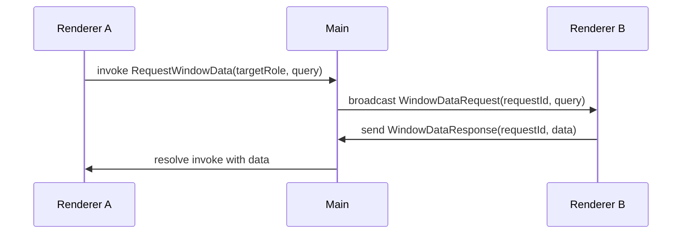
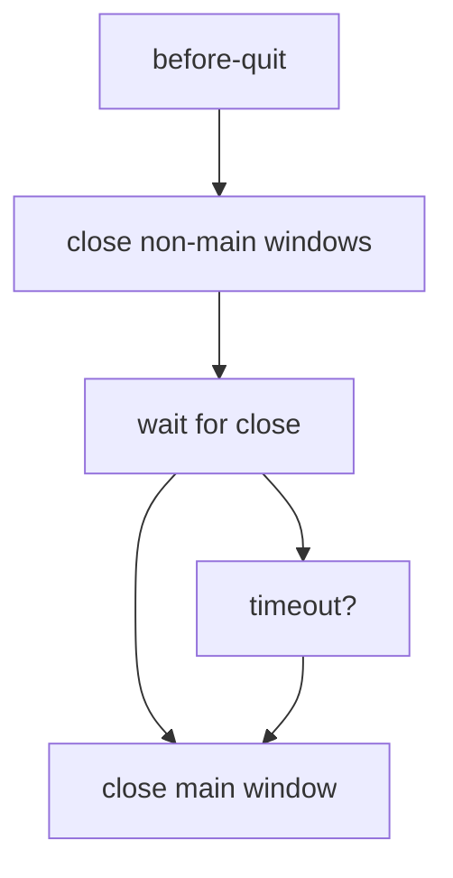

# Multi-Window Patterns

Advanced patterns and best practices for building multi-window Electron applications with electron-ipc.

## Overview

Multi-window applications require careful coordination between windows, centralized state management, and efficient inter-window communication. This guide covers proven patterns and practical examples.

## Core Concepts

### Window Registry Pattern

Centralize window tracking with the WindowRegistry:

```typescript
import { getWindowRegistry } from '@number10/electron-ipc/window-manager'

function createMainWindow() {
  const mainWindow = new BrowserWindow({
    width: 1200,
    height: 800,
    webPreferences: {
      preload: path.join(__dirname, '../preload/index.js'),
      contextIsolation: true,
    },
  })

  // Register immediately after creation
  getWindowRegistry().register(mainWindow, 'main')

  mainWindow.loadFile('index.html')
  return mainWindow
}

function createSettingsWindow() {
  const settingsWindow = new BrowserWindow({
    width: 600,
    height: 400,
    parent: getMainWindow() ?? undefined, // Optional parent
    modal: false,
    webPreferences: {
      preload: path.join(__dirname, '../preload/index.js'),
      contextIsolation: true,
    },
  })

  getWindowRegistry().register(settingsWindow, 'settings')

  settingsWindow.loadFile('settings.html')
  return settingsWindow
}
```

### Role-Based Organization

Define consistent window roles:

```typescript
// window-roles.ts
export const WindowRole = {
  MAIN: 'main',
  SETTINGS: 'settings',
  PREVIEW: 'preview',
  EDITOR: 'editor',
  DASHBOARD: 'dashboard',
  INSPECTOR: 'inspector', // Reserved for IPC Inspector
} as const

export type WindowRoleType = (typeof WindowRole)[keyof typeof WindowRole]
```

Usage:

```typescript
import { WindowRole } from './window-roles'

getWindowRegistry().register(window, WindowRole.SETTINGS)
const settingsWindows = getWindowRegistry().getByRole(WindowRole.SETTINGS)
```

## Communication Patterns

### Pattern 1: Broadcast to All Windows

Send data to all application windows:

```typescript
import { broadcastToApp } from '@number10/electron-ipc/window-manager'
import type { BroadcastContracts } from '@gen/ipc-api'

const broadcast = broadcastToApp<BroadcastContracts>()

// Broadcast to all windows (excludes inspector automatically)
broadcast('DataUpdated', { timestamp: Date.now(), data: newData })

// All renderer processes receive this
window.api.onDataUpdated((payload) => {
  console.log('Data updated:', payload)
  updateUI(payload.data)
})
```

### Pattern 2: Broadcast to Specific Role

Target windows by role:

```typescript
import { createBroadcastToRole } from '@number10/electron-ipc/window-manager'

const broadcastToEditors = createBroadcastToRole<BroadcastContracts>('editor')

// Only editor windows receive this
broadcastToEditors('DocumentChanged', { docId: '123', content: 'updated content' })
```

### Pattern 3: Window-to-Window Communication

Renderer A → Main → Renderer B:

```typescript
// ipc-api.ts
export const ipcAPI = {
  invoke: createSchema<{
    SendToWindow: IInvokeContract<{ targetRole: string; message: string; data?: unknown }, void>
  }>(),
  // ...
}

// Main process handler
class RegisterHandler extends AbstractRegisterHandler {
  handlers: IPCHandlerType<InvokeContracts> = {
    SendToWindow: async (_event, { targetRole, message, data }) => {
      const broadcast = createBroadcastToRole<BroadcastContracts>(targetRole)
      broadcast('WindowMessage', { message, data })
    },
  }
}

// Renderer A (sender)
await window.api.invokeSendToWindow({
  targetRole: 'settings',
  message: 'reload-config',
  data: { configPath: './config.json' },
})

// Renderer B (receiver in settings window)
window.api.onWindowMessage(({ message, data }) => {
  if (message === 'reload-config') {
    loadConfig(data.configPath)
  }
})
```

### Pattern 4: Request-Response Between Windows

Window A requests data from Window B:



```typescript
// ipc-api.ts
export const ipcAPI = {
  invoke: createSchema<{
    RequestWindowData: IInvokeContract<{ targetRole: string; query: string }, { data: unknown }>
  }>(),
  broadcast: createSchema<{
    WindowDataRequest: IBroadcastContract<{ requestId: string; query: string }>
    WindowDataResponse: IBroadcastContract<{ requestId: string; data: unknown }>
  }>(),
}

// Main process
class RegisterHandler extends AbstractRegisterHandler {
  handlers: IPCHandlerType<InvokeContracts> = {
    RequestWindowData: async (_event, { targetRole, query }) => {
      const requestId = crypto.randomUUID()

      return new Promise((resolve) => {
        // Listen for response
        const cleanup = mainBroadcast.onWindowDataResponse((payload) => {
          if (payload.requestId === requestId) {
            cleanup()
            resolve({ data: payload.data })
          }
        })

        // Send request
        const broadcast = createBroadcastToRole<BroadcastContracts>(targetRole)
        broadcast('WindowDataRequest', { requestId, query })

        // Timeout after 5 seconds
        setTimeout(() => {
          cleanup()
          resolve({ data: null })
        }, 5000)
      })
    },
  }
}

// Window B (data provider)
window.api.onWindowDataRequest(({ requestId, query }) => {
  const data = processQuery(query)
  // Send response back
  window.api.sendWindowDataResponse({ requestId, data })
})

// Window A (requester)
const { data } = await window.api.invokeRequestWindowData({
  targetRole: 'dashboard',
  query: 'sales-data',
})
```

## State Synchronization

### Pattern 5: Shared State Manager

Centralized state in main process:

```typescript
// state-manager.ts (main process)
class AppStateManager {
  private state: AppState = {
    theme: 'light',
    language: 'en',
    settings: {},
  }

  private broadcast = broadcastToApp<BroadcastContracts>()

  updateTheme(theme: 'light' | 'dark') {
    this.state.theme = theme
    this.broadcast('StateChanged', { state: this.state })
  }

  updateSettings(settings: Partial<Settings>) {
    this.state.settings = { ...this.state.settings, ...settings }
    this.broadcast('StateChanged', { state: this.state })
  }

  getState() {
    return { ...this.state }
  }
}

export const stateManager = new AppStateManager()

// IPC handlers
class RegisterHandler extends AbstractRegisterHandler {
  handlers: IPCHandlerType<InvokeContracts> = {
    GetAppState: async () => stateManager.getState(),
    UpdateTheme: async (_event, { theme }) => {
      stateManager.updateTheme(theme)
    },
  }
}

// Renderer (all windows)
window.api.onStateChanged(({ state }) => {
  applyTheme(state.theme)
  updateSettings(state.settings)
})

// Get initial state
const state = await window.api.invokeGetAppState()
```

### Pattern 6: Window-Specific State

Track state per window:

```typescript
// window-state-manager.ts
import { getWindowRegistry } from '@number10/electron-ipc/window-manager'

interface WindowState {
  data: unknown
  lastUpdated: number
}

class WindowStateManager {
  private states = new Map<number, WindowState>()

  setState(windowId: number, data: unknown) {
    this.states.set(windowId, {
      data,
      lastUpdated: Date.now(),
    })
  }

  getState(windowId: number): WindowState | undefined {
    return this.states.get(windowId)
  }

  getAllStates(): Map<number, WindowState> {
    const registry = getWindowRegistry()
    const activeIds = new Set(registry.getAll().map((m) => m.id))

    // Clean up destroyed windows
    this.states.forEach((_, id) => {
      if (!activeIds.has(id)) {
        this.states.delete(id)
      }
    })

    return this.states
  }
}

export const windowStateManager = new WindowStateManager()
```

## Lifecycle Management

### Pattern 7: Singleton Windows

Ensure only one instance of a window type:

```typescript
// window-factory.ts
import { getWindowRegistry } from '@number10/electron-ipc/window-manager'
import { WindowRole } from './window-roles'

const windowInstances = new Map<string, BrowserWindow>()

export function getOrCreateWindow(role: string, factory: () => BrowserWindow): BrowserWindow {
  // Check if window already exists
  const existing = getWindowRegistry()
    .getByRole(role)
    .find((meta) => !meta.window.isDestroyed())

  if (existing) {
    existing.window.show()
    existing.window.focus()
    return existing.window
  }

  // Create new window
  const window = factory()
  getWindowRegistry().register(window, role)

  // Cleanup on close
  window.on('closed', () => {
    windowInstances.delete(role)
  })

  windowInstances.set(role, window)
  return window
}

// Usage
const settingsWindow = getOrCreateWindow(WindowRole.SETTINGS, () => {
  return new BrowserWindow({
    width: 600,
    height: 400,
    webPreferences: {
      preload: path.join(__dirname, '../preload/index.js'),
    },
  })
})
```

### Pattern 8: Parent-Child Windows

Modal dialogs and child windows:

```typescript
function createDialogWindow(
  parent: BrowserWindow | null,
  options: {
    title: string
    modal?: boolean
    width?: number
    height?: number
  }
): BrowserWindow {
  const dialog = new BrowserWindow({
    width: options.width ?? 400,
    height: options.height ?? 300,
    title: options.title,
    parent: parent ?? undefined,
    modal: options.modal ?? false,
    show: false,
    webPreferences: {
      preload: path.join(__dirname, '../preload/index.js'),
    },
  })

  getWindowRegistry().register(dialog, 'dialog')

  // Show when ready
  dialog.once('ready-to-show', () => {
    dialog.show()
  })

  return dialog
}

// Usage
const mainWindow = getWindowRegistry().getMain()?.window
const confirmDialog = createDialogWindow(mainWindow, {
  title: 'Confirm Action',
  modal: true,
  width: 400,
  height: 200,
})
```

### Pattern 9: Graceful Shutdown

Close all windows in correct order:



```typescript
import { getWindowRegistry } from '@number10/electron-ipc/window-manager'

async function gracefulShutdown() {
  const registry = getWindowRegistry()
  const allWindows = registry.getAll()

  // 1. Close non-main windows first
  const nonMainWindows = allWindows.filter((meta) => meta.role !== 'main')

  for (const meta of nonMainWindows) {
    if (!meta.window.isDestroyed()) {
      meta.window.close()
    }
  }

  // 2. Wait for windows to close
  await new Promise((resolve) => setTimeout(resolve, 100))

  // 3. Close main window last
  const mainWindow = registry.getMain()
  if (mainWindow && !mainWindow.window.isDestroyed()) {
    mainWindow.window.close()
  }
}

app.on('before-quit', async (event) => {
  event.preventDefault()
  await gracefulShutdown()
  app.exit(0)
})
```

## Focus Management

### Pattern 10: Focus Tracking

Track which window was focused last:

```typescript
import { getWindowRegistry } from '@number10/electron-ipc/window-manager'

function getMostRecentlyFocusedWindow(): BrowserWindow | null {
  const registry = getWindowRegistry()
  const windows = registry.getAll()

  if (windows.length === 0) return null

  // Sort by lastFocusedAt
  windows.sort((a, b) => {
    const timeA = a.lastFocusedAt ?? a.createdAt
    const timeB = b.lastFocusedAt ?? b.createdAt
    return timeB - timeA
  })

  return windows[0].window
}

// Usage in IPC handler
class RegisterHandler extends AbstractRegisterHandler {
  handlers: IPCHandlerType<InvokeContracts> = {
    GetFocusedWindow: async () => {
      const focused = getMostRecentlyFocusedWindow()
      return {
        id: focused?.id ?? null,
        title: focused?.getTitle() ?? null,
      }
    },
  }
}
```

## Window Menus

### Pattern 11: Window Menu with Registry

Create menu items for all windows:

```typescript
import { Menu } from 'electron'
import { getWindowRegistry } from '@number10/electron-ipc/window-manager'

function createWindowMenu(): Menu {
  const registry = getWindowRegistry()
  const windows = registry.getAll()

  const menuTemplate: MenuItemConstructorOptions[] = [
    {
      label: 'New Window',
      accelerator: 'CmdOrCtrl+N',
      click: () => createSecondaryWindow(),
    },
    { type: 'separator' },
    ...windows.map((meta) => ({
      label: meta.window.getTitle(),
      type: 'radio' as const,
      checked: meta.window.isFocused(),
      click: () => {
        meta.window.show()
        meta.window.focus()
      },
    })),
  ]

  return Menu.buildFromTemplate(menuTemplate)
}

// Update menu when windows change
function updateWindowMenu() {
  const menu = Menu.getApplicationMenu()
  if (!menu) return

  const windowMenu = createWindowMenu()
  // Update Window submenu
  const windowMenuItem = menu.items.find((item) => item.label === 'Window')
  if (windowMenuItem && windowMenuItem.submenu) {
    windowMenuItem.submenu = windowMenu
  }
}

// Listen for window events
app.on('browser-window-created', () => {
  setTimeout(updateWindowMenu, 100)
})

app.on('browser-window-focus', () => {
  updateWindowMenu()
})
```

## Performance Optimization

### Pattern 12: Lazy Window Creation

Create windows on demand:

```typescript
class WindowPool {
  private creators = new Map<string, () => BrowserWindow>()

  register(role: string, creator: () => BrowserWindow) {
    this.creators.set(role, creator)
  }

  getOrCreate(role: string): BrowserWindow | null {
    const registry = getWindowRegistry()

    // Check existing
    const existing = registry.getByRole(role).find((m) => !m.window.isDestroyed())
    if (existing) {
      existing.window.show()
      existing.window.focus()
      return existing.window
    }

    // Create new
    const creator = this.creators.get(role)
    if (!creator) return null

    const window = creator()
    registry.register(window, role)
    return window
  }
}

export const windowPool = new WindowPool()

// Setup
windowPool.register(
  'settings',
  () =>
    new BrowserWindow({
      /* ... */
    })
)
windowPool.register(
  'preview',
  () =>
    new BrowserWindow({
      /* ... */
    })
)

// Usage
const settingsWindow = windowPool.getOrCreate('settings')
```

### Pattern 13: Window Pooling

Reuse hidden windows instead of destroying:

```typescript
class ReusableWindowPool {
  private pool = new Map<string, BrowserWindow[]>()

  acquire(role: string, factory: () => BrowserWindow): BrowserWindow {
    const available = this.pool.get(role) ?? []

    if (available.length > 0) {
      const window = available.pop()!
      this.pool.set(role, available)
      window.show()
      return window
    }

    const window = factory()
    getWindowRegistry().register(window, role)
    return window
  }

  release(window: BrowserWindow, role: string) {
    // Hide instead of destroy
    window.hide()

    const pool = this.pool.get(role) ?? []
    pool.push(window)
    this.pool.set(role, pool)
  }

  destroy() {
    this.pool.forEach((windows) => {
      windows.forEach((w) => {
        if (!w.isDestroyed()) w.destroy()
      })
    })
    this.pool.clear()
  }
}
```

## Security Considerations

### Pattern 14: Role-Based Permissions

Restrict IPC operations by window role:

```typescript
import { getWindowRoleFromEvent } from '@number10/electron-ipc/window-manager'

class RegisterHandler extends AbstractRegisterHandler {
  handlers: IPCHandlerType<InvokeContracts> = {
    DeleteAllData: async (event) => {
      const role = getWindowRoleFromEvent(event)

      // Only allow from main window
      if (role !== 'main') {
        throw new Error('Permission denied: Operation only allowed from main window')
      }

      await deleteAllData()
    },

    GetSensitiveData: async (event) => {
      const role = getWindowRoleFromEvent(event)

      // Block external windows
      const allowedRoles = ['main', 'settings']
      if (!allowedRoles.includes(role ?? '')) {
        throw new Error('Permission denied: Unauthorized window')
      }

      return await getSensitiveData()
    },
  }
}
```

### Pattern 15: Isolated Window Contexts

Separate untrusted content:

```typescript
function createUntrustedWindow(url: string): BrowserWindow {
  const untrustedWindow = new BrowserWindow({
    width: 800,
    height: 600,
    webPreferences: {
      // Maximum isolation
      contextIsolation: true,
      nodeIntegration: false,
      sandbox: true,
      webSecurity: true,
      allowRunningInsecureContent: false,
      // No preload script - no IPC access
      preload: undefined,
    },
  })

  // Register but don't provide IPC access
  getWindowRegistry().register(untrustedWindow, 'untrusted')

  untrustedWindow.loadURL(url)
  return untrustedWindow
}
```

## Testing Multi-Window Apps

### Testing with Registry

```typescript
import { beforeEach, describe, expect, it, vi } from 'vitest'
import { getWindowRegistry, resetWindowRegistry } from '@number10/electron-ipc/window-manager'

describe('Multi-Window App', () => {
  beforeEach(() => {
    resetWindowRegistry()
  })

  it('should track all windows', () => {
    const main = createMockWindow(1)
    const secondary = createMockWindow(2)

    getWindowRegistry().register(main, 'main')
    getWindowRegistry().register(secondary, 'secondary')

    expect(getWindowRegistry().count()).toBe(2)
  })

  it('should broadcast to specific role', () => {
    const main = createMockWindow(1)
    const secondary1 = createMockWindow(2)
    const secondary2 = createMockWindow(3)

    getWindowRegistry().register(main, 'main')
    getWindowRegistry().register(secondary1, 'secondary')
    getWindowRegistry().register(secondary2, 'secondary')

    const broadcast = createBroadcastToRole<BroadcastContracts>('secondary')
    broadcast('Test', { data: 'test' })

    expect(secondary1.webContents.send).toHaveBeenCalled()
    expect(secondary2.webContents.send).toHaveBeenCalled()
    expect(main.webContents.send).not.toHaveBeenCalled()
  })
})
```

## Common Pitfalls

### ❌ Avoid: Forgetting to Register Windows

```typescript
// BAD: Window not registered
const window = new BrowserWindow({
  /* ... */
})
broadcastToApp('Update', data) // Window won't receive this!
```

```typescript
// GOOD: Always register
const window = new BrowserWindow({
  /* ... */
})
getWindowRegistry().register(window, 'main')
broadcastToApp('Update', data) // All registered windows receive it
```

### ❌ Avoid: Using Destroyed Windows

```typescript
// BAD: Not checking if destroyed
const main = getWindowRegistry().getMain()
main.window.show() // Might crash if destroyed!
```

```typescript
// GOOD: Always check
const main = getWindowRegistry().getMain()
if (main && !main.window.isDestroyed()) {
  main.window.show()
}
```

### ❌ Avoid: Broadcasting to Inspector

```typescript
// BAD: Inspector receives app data
createBroadcastToAll<BroadcastContracts>()('AppData', data)
```

```typescript
// GOOD: Use broadcastToApp (auto-excludes inspector)
broadcastToApp<BroadcastContracts>()('AppData', data)
```

### ❌ Avoid: Hardcoded Window IDs

```typescript
// BAD: Fragile, IDs change
const window = BrowserWindow.fromId(42)
```

```typescript
// GOOD: Use registry with roles
const main = getWindowRegistry().getMain()
const settings = getWindowRegistry().getByRole('settings')[0]
```

## Real-World Example

Complete multi-window app structure:

```typescript
// main/window-manager.ts
import { app, BrowserWindow } from 'electron'
import { getWindowRegistry } from '@number10/electron-ipc/window-manager'
import { WindowRole } from './window-roles'

class AppWindowManager {
  createMainWindow() {
    const main = new BrowserWindow({
      width: 1200,
      height: 800,
      webPreferences: {
        preload: path.join(__dirname, '../preload/index.js'),
      },
    })

    getWindowRegistry().register(main, WindowRole.MAIN)
    main.loadFile('index.html')
    return main
  }

  createSecondaryWindow() {
    const secondary = new BrowserWindow({
      width: 800,
      height: 600,
      webPreferences: {
        preload: path.join(__dirname, '../preload/index.js'),
      },
    })

    getWindowRegistry().register(secondary, WindowRole.SECONDARY)
    secondary.loadFile('secondary.html')
    return secondary
  }

  getActiveWindowCount(): number {
    return getWindowRegistry().count()
  }

  closeAllSecondaryWindows() {
    const registry = getWindowRegistry()
    const secondaries = registry.getByRole(WindowRole.SECONDARY)

    secondaries.forEach((meta) => {
      if (!meta.window.isDestroyed()) {
        meta.window.close()
      }
    })
  }
}

export const windowManager = new AppWindowManager()
```

See the `apps/multi-window` directory in the repository for a complete working example.

## Resources

- [Window Manager API Reference](./window-manager.md)
- [Security Best Practices](./security.md)
- [Inspector Documentation](./inspector.md)
