# Electron IPC Code Generator

Type-safe IPC communication generator for Electron applications with streaming support.

## Overview

This monorepo contains a TypeScript code generator that creates type-safe IPC (Inter-Process Communication) APIs for Electron applications. It eliminates boilerplate code and ensures type safety across main, preload, and renderer processes.

**The Key Benefit:** When you change an IPC contract interface, TypeScript immediately shows compile errors everywhere the contract is used incorrectly - before you even run the code. No runtime surprises!

## Architecture

### Communication Flow

The following diagram shows how the four IPC contract types work together in an Electron application:


- **`packages/electron-ipc`** - Main library with code generator and runtime helpers
- **`packages/template-basic`** - Self-generating template demonstrating best practices

### Example Applications

The repository includes multiple example apps demonstrating different bundlers and use cases:

- **`apps/test-app`** - Main test application with electron-vite (full feature showcase)
- **`apps/multi-window`** - Multi-window IPC flows with window registry and role-based broadcasts
- **`apps/high-volume-test`** - Inspector performance testing under high-volume IPC traffic
- **`apps/esbuild-minimal`** - Minimal example with esbuild bundler
- **`apps/webpack-minimal`** - Minimal example with webpack bundler
- **`apps/parcel-minimal`** - Minimal example with Parcel 2.x bundler

### How It Works

1. **Define IPC Contracts** in your main process using TypeScript interfaces
2. **Run the Generator** via YAML configuration to create type-safe API code
3. **Use Generated API** in preload/renderer with full TypeScript support
4. **Abstract Register Handler** in main/index for secure registration of the Invoke/Events/Broadcast interfaces

## Additional Modules

The generator ships with optional runtime modules:

- **Window Management**: Central registry + multi-window broadcast helpers.
  See [Window Management](./window-manager).
- **IPC Inspector**: Dev-only IPC tracing UI with payload previews and export.
  See [IPC Inspector](./inspector).

## IPC Contract Types

The generator supports five types of IPC communication:

```mermaid
flowchart LR
    I["Invoke<br/>Renderer ↔ Main<br/>prefix: invoke"]
    E["Event<br/>Renderer → Main<br/>prefix: send"]
    B["Broadcast<br/>Main → Renderer<br/>prefix: on"]
    R["Renderer Invoke<br/>Renderer ↔ Renderer<br/>prefix: rendererInvoke"]
    S["Stream<br/>Renderer ↔ Main<br/>prefix: invokeStream/upload/download"]
```



### 1. Invoke (Renderer ↔ Main, Request/Response)

Renderer calls main process and waits for response:

```typescript
export type InvokeContracts = GenericInvokeContract<{
  GetVersion: IInvokeContract<void, string>
  AddNumbers: IInvokeContract<{ a: number; b: number }, number>
}>
```

**Why these wrapper types?** `GenericInvokeContract` and `IInvokeContract` enforce a strict structure with `request` and `response` properties. This structured format is required so the generator can reliably parse and generate type-safe code. You cannot deviate from this pattern - it ensures the generator knows exactly what types to extract.

**Generated method names:** The generator prefixes invoke methods with `invoke`:

- `AddNumbers` → `window.api.invokeAddNumbers(params)`
- `GetVersion` → `window.api.invokeGetVersion()`

### 2. Event (Renderer → Main)

Renderer sends events to main process without expecting a response:

```typescript
export type EventContracts = GenericRendererEventContract<{
  Quit: IRendererEventContract<void>
  LogMessage: IRendererEventContract<string>
}>
```

**Why these wrapper types?** `GenericRendererEventContract` and `IRendererEventContract` enforce the structure with a `request` property. This is necessary for the generator to extract the payload type correctly.

**Generated method names:** The generator prefixes event methods with `send`:

- `Quit` → `window.api.sendQuit()`
- `LogMessage` → `window.api.sendLogMessage(message)`

### 3. Broadcast (Main → Renderer)

Main process sends data/events to renderer (one-way only):

```typescript
export type BroadcastContracts = GenericBroadcastContract<{
  Ping: IBroadcastContract<number>
  About: IBroadcastContract<void>
}>
```

**Why these wrapper types?** `GenericBroadcastContract` and `IBroadcastContract` enforce the structure with a `payload` property. This structured format is required so the generator can reliably parse and generate type-safe code, just like the other contract types.

**Generated method names:** The generator prefixes broadcast listeners with `on`:

- `Ping` → `window.api.onPing((count) => ...)`
- `About` → `window.api.onAbout(() => ...)`

### 4. Renderer Invoke (Renderer ↔ Renderer via Main)

Type-safe request-response communication between renderer processes, routed through main process for security:

```typescript
export type RendererInvokeContracts = GenericRendererInvokeContract<{
  GetDashboardData: IRendererInvokeContract<{ query: string }, { data: unknown[]; total: number }>
  UpdateSettings: IRendererInvokeContract<{ theme: 'light' | 'dark' }, { success: boolean }>
}>
```

**Why these wrapper types?** `GenericRendererInvokeContract` and `IRendererInvokeContract` enforce the structure with `request` and `response` properties, ensuring the generator can extract types correctly for both the caller and handler sides.

**Generated method names:**

- Caller: `window.api.rendererInvokeGetDashboardData('targetRole', request)` → sends to target window
- Handler: `window.api.handleGetDashboardData((request, context) => { ... })` → registers handler in target window

**Requirements:**

- Initialize router in main: `initRendererInvokeRouter()`
- Register windows with roles: `getWindowRegistry().register(window, 'dashboard')`

See [Renderer-to-Renderer IPC](./renderer-to-renderer) for detailed guide.

### 5. Streams (Large Data & Real-time)

For efficient handling of large data transfers or real-time data streams using Web Streams API:


```typescript
// Stream Invoke: Request-response with streaming response
export type StreamInvokeContracts = GenericStreamInvokeContract<{
  GetLargeData: IStreamInvokeContract<{ offset: number }, string>
}>

// Stream Upload: Renderer uploads data to main
export type StreamUploadContracts = GenericStreamUploadContract<{
  UploadFile: IStreamUploadContract<{ filename: string }, Uint8Array>
}>

// Stream Download: Main streams data to renderer
export type StreamDownloadContracts = GenericStreamDownloadContract<{
  DownloadLogs: IStreamDownloadContract<{ sinceMs: number }, string>
}>
```

**Generated method names:**

- Stream Invoke: `invokeStreamGetLargeData(request, callbacks)` → starts stream, returns cleanup
- Stream Upload: `uploadUploadFile(request)` → returns StreamWriter
- Stream Download: `downloadDownloadLogs(request, onData, onEnd?, onError?)` → starts stream, returns cleanup

## Workflow

### 1. Define Contracts

Create IPC contracts in your main process (`src/main/ipc-api.ts`):

```typescript
import {
  createBroadcast,
  GenericBroadcastContract,
  GenericInvokeContract,
  GenericRendererEventContract,
  GenericStreamInvokeContract,
  GenericStreamUploadContract,
  GenericStreamDownloadContract,
  IBroadcastContract,
  IInvokeContract,
  IRendererEventContract,
} from '@number10/electron-ipc'

// Invoke: Renderer calls main and gets response
export type InvokeContracts = GenericInvokeContract<{
  AddNumbers: IInvokeContract<{ a: number; b: number }, number>
  GetVersion: IInvokeContract<void, string>
}>

// Event: Renderer sends events to main
export type EventContracts = GenericRendererEventContract<{
  Quit: IRendererEventContract<void>
  LogMessage: IRendererEventContract<string>
}>

// Broadcast: Main sends to renderer (one-way)
export type BroadcastContracts = GenericBroadcastContract<{
  Ping: IBroadcastContract<number>
  About: IBroadcastContract<void>
}>

// Renderer Invoke: Renderer-to-renderer via main routing (multi-window apps)
export type RendererInvokeContracts = GenericRendererInvokeContract<{
  GetDashboardData: IRendererInvokeContract<{ query: string }, { data: unknown[]; total: number }>
}>

// Streams: Large data and real-time communication
export type StreamInvokeContracts = GenericStreamInvokeContract<{
  GetLargeData: IStreamInvokeContract<{ offset: number }, string>
}>

export type StreamUploadContracts = GenericStreamUploadContract<{
  UploadFile: IStreamUploadContract<{ filename: string }, Uint8Array>
}>

export type StreamDownloadContracts = GenericStreamDownloadContract<{
  DownloadLogs: IStreamDownloadContract<{ sinceMs: number }, string>
}>

// Optional: Create runtime broadcast helper (if not using generated API)
// export const mainBroadcast = createBroadcast<BroadcastContracts>()
```

## Configuration File

For managing IPC APIs, use a YAML configuration file:

```yaml
# ipc-config.yaml
apis:
  - name: api
    input: ./src/main/ipc-api.ts
    output: ./src/preload/api-generated.ts
    tsconfig: ./tsconfig.json
    contracts:
      invoke: InvokeContracts
      event: EventContracts
      send: BroadcastContracts
      rendererInvoke: RendererInvokeContracts
    mainBroadcastOutput: ./src/main/broadcast-generated.ts

  - name: streamApi
    input: ./src/main/ipc-api-stream.ts
    output: ./src/preload/api-stream-generated.ts
    contracts:
      streamInvoke: StreamInvokeContracts
      streamUpload: StreamUploadContracts
      streamDownload: StreamDownloadContracts
```

Diagram: how the config maps to generated outputs:


Generate all APIs:

```bash
electron-ipc-generate --config=./ipc-config.yaml

# Watch mode (auto-regenerate on changes)
electron-ipc-generate --config=./ipc-config.yaml --watch

# CI mode (verify outputs without writing)
electron-ipc-generate --config=./ipc-config.yaml --check
```

Each API gets a unique expose function name (e.g., `exposeApi`, `exposeStreamApi`).

### 3. Use in Preload

Expose the generated API via context bridge (`src/preload/index.ts`):

```typescript
import { exposeMyApi, MyApiType } from './api-generated'

declare global {
  interface Window {
    myApi: MyApiType
  }
}

exposeMyApi()
```

**Alternative:** You can also use the contextBridge directly:

```typescript
import { contextBridge } from 'electron'
import { myApi } from './api-generated'

contextBridge.exposeInMainWorld('myApi', myApi)
```

### 4. Use in Renderer

Access the API with full TypeScript support (`src/renderer/App.tsx`):

```typescript
// Invoke: Call main and await response (prefixed with 'invoke')
const result = await window.myApi.invokeAddNumbers({ a: 5, b: 3 }) // result = 8
const version = await window.myApi.invokeGetVersion()

// Event: Send to main (prefixed with 'send')
window.myApi.sendQuit()
window.myApi.sendLogMessage('User clicked button')

// Broadcast: Listen to events from main (prefixed with 'on')
window.myApi.onPing((count) => console.log(`Ping ${count}`))
window.myApi.onAbout(() => console.log('About dialog'))

// Streams: Handle large data and real-time communication
const stopStream = window.myApi.invokeStreamGetLargeData(
  { offset: 0 },
  {
    onData: (chunk) => console.log('Received:', chunk),
    onEnd: () => console.log('Stream complete'),
    onError: (err) => console.error(err),
  }
)

const uploadStream = window.myApi.uploadUploadFile({ filename: 'data.txt' })
await uploadStream.write(new Uint8Array([1, 2, 3, 4, 5]))
await uploadStream.close()

const stopDownload = window.myApi.downloadDownloadLogs(
  { sinceMs: Date.now() },
  (log) => console.log('Log:', log),
  () => console.log('Download complete'),
  (err) => console.error(err)
)

// Note: Date is not serializable; use timestamps or ISO strings instead.

// Optional: stop stream early
// stopStream()
// stopDownload()
```

### React Hooks (Optional)

If you're using React, enable automatic hook generation in your configuration:

```yaml
apis:
  - name: api
    # ... other config
    reactHooksOutput: ./src/renderer/hooks/api-hooks.ts
```

This generates type-safe React hooks for all contract types:

**useInvokeContracts** - For invoke operations with automatic state management:

```typescript
import { useInvokeContracts } from './hooks/api-hooks'

function MyComponent() {
  const { data, loading, error, invoke } = useInvokeContracts('AddNumbers')

  const handleClick = async () => {
    try {
      const result = await invoke({ a: 5, b: 3 })
      console.log('Result:', result) // 8
    } catch (err) {
      console.error('Error:', err)
    }
  }

  return (
    <div>
      {loading && <p>Loading...</p>}
      {error && <p>Error: {error.message}</p>}
      {data && <p>Result: {data}</p>}
      <button onClick={handleClick}>Add Numbers</button>
    </div>
  )
}
```

**useEventContracts** - For sending events to main:

```typescript
import { useEventContracts } from './hooks/api-hooks'

function LogComponent() {
  const { send } = useEventContracts('LogMessage')

  return <button onClick={() => send('User clicked button')}>Log Message</button>
}
```

**useBroadcastContracts** - For listening to broadcasts with automatic cleanup:

```typescript
import { useBroadcastContracts } from './hooks/api-hooks'
import { useEffect } from 'react'

function PingDisplay() {
  const { data, subscribe, unsubscribe } = useBroadcastContracts('Ping')

  useEffect(() => {
    const unsubscribeFn = subscribe((count) => {
      console.log('Received ping:', count)
    })
    return unsubscribeFn
  }, [subscribe])

  return <div>Ping count: {data}</div>
}
```

**useStreamInvokeContracts**, **useStreamUploadContracts**, **useStreamDownloadContracts** - For streaming operations:

```typescript
import { useStreamDownloadContracts } from './hooks/api-hooks'

function LogViewer() {
  const { data, loading, error, startStream, stopStream } = useStreamDownloadContracts('DownloadLogs')

  const handleStart = () => {
    startStream({ sinceMs: Date.now() - 3600000 }) // Last hour
  }

  return (
    <div>
      <button onClick={handleStart} disabled={loading}>
        Start Stream
      </button>
      <button onClick={stopStream} disabled={!loading}>
        Stop Stream
      </button>
      {data.map((log, i) => (
        <div key={i}>{log}</div>
      ))}
    </div>
  )
}
```

**Note:** The generated broadcast API (`mainBroadcastOutput`) is optional but recommended for consistency with the renderer API. Both approaches are type-safe.

### 5. Implement Handlers in Main

Handle IPC calls in main process (`src/main/index.ts`):

```typescript
import {
  AbstractRegisterHandler,
  AbstractRegisterEvent,
  AbstractRegisterStreamHandler,
  AbstractRegisterStreamUpload,
  AbstractRegisterStreamDownload,
  IPCHandlerType,
  IPCEventType,
} from '@number10/electron-ipc'
import { InvokeContracts, EventContracts, BroadcastContracts } from './ipc-api'

// Implement invoke handlers (request/response)
class RegisterHandler extends AbstractRegisterHandler {
  handlers: IPCHandlerType<InvokeContracts> = {
    AddNumbers: async (_event, params) => {
      return params.a + params.b
    },
    GetVersion: async () => {
      return app.getVersion()
    },
  }
}

// Implement event handlers (renderer → main)
class RegisterEvent extends AbstractRegisterEvent {
  events: IPCEventType<EventContracts> = {
    Quit: () => {
      app.quit()
    },
    LogMessage: (_event, message) => {
      console.log(`Renderer: ${message}`)
    },
  }
}

// Implement stream invoke handlers (request with streaming response)
class RegisterStreamHandler extends AbstractRegisterStreamHandler {
  handlers: IPCStreamHandlerType<StreamInvokeContracts> = {
    GetLargeData: async (_event, { offset }) => {
      // Return a ReadableStream
      return createReadableStreamFromLargeData(offset)
    },
  }
}

// Implement stream upload handlers (renderer → main)
class RegisterStreamUpload extends AbstractRegisterStreamUpload {
  handlers: IPCStreamUploadHandlerType<StreamUploadContracts> = {
    UploadFile: ({ filename }, onData, onEnd, onError) => {
      const chunks: Uint8Array[] = []
      onData((chunk) => {
        chunks.push(chunk)
      })
      onEnd(() => {
        // Process uploaded data...
        console.log(`Upload complete for ${filename} (${chunks.length} chunks)`)
      })
      onError((err) => {
        console.error(`Upload failed for ${filename}`, err)
      })
    },
  }
}

// Implement stream download handlers (main → renderer)
class RegisterStreamDownload extends AbstractRegisterStreamDownload {
  handlers: IPCStreamDownloadHandlerType<StreamDownloadContracts> = {
    DownloadLogs: async ({ sinceMs }, _event) => {
      // Return a ReadableStream for logs
      return createLogStream(sinceMs)
    },
  }
}

// Register all handlers
RegisterHandler.register()
RegisterEvent.register()
RegisterStreamHandler.register()
RegisterStreamUpload.register()
RegisterStreamDownload.register()
```

**Optional: typed handler helpers**

You can keep handlers in plain objects and still get full typing:

```typescript
import {
  defineEventHandlers,
  defineInvokeHandlers,
  defineStreamDownloadHandlers,
} from '@number10/electron-ipc'

const invokeHandlers = defineInvokeHandlers<InvokeContracts>({
  AddNumbers: async (_event, params) => params.a + params.b,
  GetVersion: async () => app.getVersion(),
})

const eventHandlers = defineEventHandlers<EventContracts>({
  Quit: () => app.quit(),
  LogMessage: (_event, message) => console.log(message),
})

const downloadHandlers = defineStreamDownloadHandlers<StreamDownloadContracts>({
  DownloadLogs: async ({ sinceMs }, _event) => createLogStream(sinceMs),
})

class RegisterHandler extends AbstractRegisterHandler {
  handlers = invokeHandlers
}

class RegisterEvent extends AbstractRegisterEvent {
  events = eventHandlers
}

class RegisterStreamDownload extends AbstractRegisterStreamDownload {
  handlers = downloadHandlers
}
```

**Optional: runtime validation helpers**

If you want runtime checks (Zod/Valibot/etc.), wrap handlers with validators. This keeps your contracts unchanged, but fails fast when payloads do not match. The helpers are validator-agnostic; any function that returns `{ success, data }` works.

```typescript
import { z } from 'zod'
import {
  defineInvokeHandlers,
  validatorFromSafeParse,
  withInvokeValidation,
} from '@number10/electron-ipc'

const requestValidator = validatorFromSafeParse(
  z.object({ a: z.number(), b: z.number() }).safeParse
)
const responseValidator = validatorFromSafeParse(z.number().safeParse)

const invokeHandlers = defineInvokeHandlers<InvokeContracts>({
  AddNumbers: withInvokeValidation(
    { request: requestValidator, response: responseValidator },
    async (_event, { a, b }) => a + b
  ),
})
```

```typescript
import { defineStreamUploadHandlers, withStreamUploadValidation } from '@number10/electron-ipc'

const uploadHandlers = defineStreamUploadHandlers<StreamUploadContracts>({
  UploadFile: withStreamUploadValidation(
    { request: requestValidator, data: validatorFromSafeParse(z.instanceof(Uint8Array).safeParse) },
    (_request, onData, onEnd, onError) => {
      onError((err) => console.error(err))
      onData((chunk) => {
        // Handle validated chunks
      })
      onEnd(() => {
        // Finalize upload
      })
    }
  ),
})
```

**Note:** For stream invoke/download handlers, pass `{ data: validator }` to validate each stream chunk.

```typescript
// Option 1: Use generated main broadcast API (recommended)
import { mainBroadcast } from './broadcast-generated'
mainBroadcast.Ping(mainWindow, 42) // with payload
mainBroadcast.About(mainWindow) // void payload omitted

// Option 2: Use runtime-generated broadcast helper (alternative)
import { createBroadcast } from '@number10/electron-ipc'
const mainBroadcast = createBroadcast<BroadcastContracts>()
mainBroadcast('Ping', mainWindow, 42)
mainBroadcast('About', mainWindow, undefined)
```

**Note:** The generated broadcast API (`mainBroadcastOutput`) is optional but recommended for consistency with the renderer API. Both approaches are type-safe.

## CLI Usage

The generator uses YAML configuration files:

```bash
electron-ipc-generate --config=./ipc-config.yaml
```

### Configuration Format

```yaml
# ipc-config.yaml
apis:
  - name: api # API name (used for expose function)
    input: ./src/main/ipc-api.ts # Source file with contracts
    output: ./src/preload/api-generated.ts # Generated preload API
    tsconfig: ./tsconfig.json # Optional: path aliases/re-exports
    contracts:
      invoke: InvokeContracts # Optional: Invoke contract type
      event: EventContracts # Optional: Event contract type
      send: BroadcastContracts # Optional: Broadcast contract type
      streamInvoke: StreamInvokeContracts # Optional: Stream invoke contracts
      streamUpload: StreamUploadContracts # Optional: Stream upload contracts
      streamDownload: StreamDownloadContracts # Optional: Stream download contracts
    mainBroadcastOutput: ./src/main/broadcast-generated.ts # Optional: Main broadcast API
    reactHooksOutput: ./src/preload/api-react-hooks.ts # Optional: Generated React hooks
```

**Note:** At least one contract type must be specified per API. The `mainBroadcastOutput` is optional; if omitted, use the runtime `createBroadcast()` helper instead.

## Examples & Templates

### Guides & Documentation

- [Electron + Vite](../examples/electron-vite) - Integration guide for electron-vite
- [Electron Forge](../examples/electron-forge) - Integration guide for Electron Forge

### Working Example Apps

All examples are in the repository and ready to run:

**Full-Featured Apps:**

- `apps/test-app` - Main demo with React, all features, Inspector integration
- `apps/multi-window` - Multi-window IPC flows, window registry, role-based broadcasts
- `apps/high-volume-test` - Inspector performance testing under high load

**Minimal Bundler Examples:**

- `apps/esbuild-minimal` - Type-safe IPC with esbuild bundler
- `apps/webpack-minimal` - Type-safe IPC with webpack bundler
- `apps/parcel-minimal` - Type-safe IPC with Parcel 2.x bundler

**Template:**

- `packages/template-basic` - Self-generating template showing best practices

Each example includes its own README with specific setup instructions.

## Benefits

✅ **Four Communication Patterns** - Invoke (request-response), Events (fire-and-forget), Broadcasts (main → renderer), Streams (large data/real-time)
✅ **Compile-Time Type Safety** - Change a contract interface → TypeScript shows errors immediately in all usages  
✅ **No Runtime Surprises** - Catch signature mismatches before running the app  
✅ **IntelliSense Everywhere** - Auto-completion in main, preload, and renderer processes  
✅ **Refactoring Support** - Rename/change contracts → TypeScript guides you to fix all usages  
✅ **Zero Boilerplate** - Auto-generated IPC wrappers and type definitions  
✅ **Single Source of Truth** - IPC contracts defined once, validated everywhere
✅ **React Hooks** - Automatic generation of `useXxx` hooks for renderer

### Example: Type Safety in Action

Change this contract:

```typescript
export type InvokeContracts = GenericInvokeContract<{
  AddNumbers: IInvokeContract<{ a: number; b: number }, number>
}>
```

To this:

```typescript
export type InvokeContracts = GenericInvokeContract<{
  AddNumbers: IInvokeContract<{ x: number; y: number }, number> // Changed a,b → x,y
}>
```

TypeScript **immediately** shows compile errors in your handler implementation:

```typescript
class RegisterHandler extends AbstractRegisterHandler {
  handlers: IPCHandlerType<InvokeContracts> = {
    AddNumbers: async (_event, v) => {
      return v.a + v.b // ❌ Error: Property 'a' does not exist on type '{ x: number; y: number }'
    },
  }
}
```

The same applies to:

- **Renderer calls** - Wrong parameters show errors in React components
- **Broadcast usage** - Type-checked at call site
- **Event handlers** - Payload types validated

No need to run the app to find these bugs! 🎯

## Development Setup

### Prerequisites

- Node.js ≥18.0.0
- pnpm ≥8.15.0
- **Windows only:** Git Bash (for Git hooks)

> **Note for Windows users:** This project uses Husky for Git hooks. Git Bash must be installed and available in your PATH for the pre-commit hooks to work properly.

### Installation

```bash
# Install dependencies
pnpm install

# Build packages
pnpm run build

# Run tests
pnpm run test

# Start test app
pnpm run dev
```

### Working on Individual Packages

```bash
# electron-ipc library
cd packages/electron-ipc
pnpm run build
pnpm run watch

# test-app
cd apps/test-app
pnpm run dev
```

### Project Structure

```
electron-ipc/
├── packages/
│   ├── electron-ipc/              # Main library (publishable to npm)
│   │   ├── src/
│   │   │   ├── generator/         # Code generation logic
│   │   │   ├── interfaces/        # TypeScript interfaces
│   │   │   ├── window-manager/    # Window registry module
│   │   │   ├── inspector/         # IPC Inspector module
│   │   │   └── index.ts
│   │   └── package.json
│   │
│   └── template-basic/            # Self-generating template
│
├── apps/                          # Example applications
│   ├── test-app/                  # Main test app (electron-vite)
│   │   ├── src/
│   │   │   ├── main/              # Main process code
│   │   │   ├── preload/           # Preload scripts
│   │   │   └── renderer/          # Renderer process (React)
│   │   └── public/                # React components
│   │
│   ├── multi-window/              # Multi-window demo (electron-vite)
│   ├── high-volume-test/          # Inspector stress test (electron-vite)
│   ├── esbuild-minimal/           # Minimal example with esbuild
│   ├── webpack-minimal/           # Minimal example with webpack
│   └── parcel-minimal/            # Minimal example with Parcel 2.x
│
├── docs-site/                     # Documentation site (VitePress)
├── package.json                   # Workspace root
└── tsconfig.json                  # Base TypeScript config
```

## 🛠 Technology Stack

- **TypeScript** - Strict mode, ES2022
- **Vite** - Build tool for library
- **electron-vite** - Build tool for Electron app
- **React** - UI framework for test app
- **Vitest** - Testing framework
- **ESLint** - Code linting (flat config)
- **Prettier** - Code formatting (no semicolons)
- **Husky** - Git hooks
- **ts-morph** - TypeScript AST manipulation
- **yaml** - YAML configuration parsing

## 🤝 Contributing

1. Create feature branch
2. Make changes
3. Run `pnpm run lint` and `pnpm run test`
4. Commit with conventional commit format:
   - `feat:` new feature
   - `fix:` bug fix
   - `docs:` documentation
   - `refactor:` code refactoring
   - `test:` testing
   - `chore:` maintenance

## 📝 License

MIT
