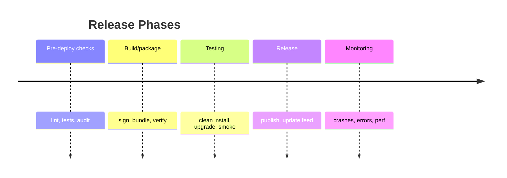

# Production Deployment Checklist

Complete checklist for deploying electron-ipc applications to production.



## Pre-Deployment

### Code Quality

- [ ] **All TypeScript strict mode enabled** - No `any` types, proper null checks
- [ ] **ESLint passes with no errors** - `pnpm run lint`
- [ ] **All tests passing** - Unit and integration tests
- [ ] **Code coverage ≥ 80%** - Critical paths covered
- [ ] **No console.log in production code** - Use proper logging
- [ ] **Dependencies audited** - `pnpm audit` or `npm audit`
- [ ] **Unused dependencies removed** - Clean package.json
- [ ] **Type definitions for all contracts** - Full TypeScript coverage

### Security

- [ ] **Context isolation enabled** - `contextIsolation: true`
- [ ] **Node integration disabled in renderer** - `nodeIntegration: false`
- [ ] **Sandbox enabled** - `sandbox: true` for renderer processes
- [ ] **CSP headers configured** - Content-Security-Policy in HTML
- [ ] **All IPC handlers have input validation** - Use validators
- [ ] **No shell commands from renderer** - Validate allowed operations
- [ ] **File paths sanitized** - Prevent path traversal attacks
- [ ] **Sensitive data not logged** - Review all log statements
- [ ] **Error messages don't leak internals** - Generic error messages to renderer
- [ ] **Credentials stored securely** - Use Electron safeStorage or keytar
- [ ] **Remote content sandboxed** - Separate windows for external content
- [ ] **Code signing configured** - macOS: Developer ID, Windows: Authenticode

### Performance

- [ ] **No blocking operations in main process** - Use workers for CPU-intensive tasks
- [ ] **Large data uses streams** - Avoid loading large files into memory
- [ ] **IPC calls minimized** - Batch operations where possible
- [ ] **Images optimized** - Compress assets
- [ ] **Source maps disabled in production** - `sourceMap: false`
- [ ] **Tree shaking enabled** - Remove unused code
- [ ] **Lazy loading implemented** - Load features on demand
- [ ] **Memory leaks tested** - Profile with DevTools

### Configuration

- [ ] **Environment-specific configs** - Different settings for dev/prod
- [ ] **Development tools disabled** - Inspector, DevTools auto-open
- [ ] **Tracing disabled or minimal** - `traceEnabled: false` or `payloadMode: 'none'`
- [ ] **Appropriate log levels** - `info` or `error` for production
- [ ] **Auto-update configured** - Electron Builder or similar
- [ ] **Update feed URL set** - HTTPS endpoint
- [ ] **Crash reporter enabled** - Electron crashReporter
- [ ] **Analytics configured** - Usage tracking (with user consent)

## Build Configuration

### Electron Builder (electron-builder)

```json
{
  "build": {
    "appId": "com.yourcompany.yourapp",
    "productName": "Your App",
    "asar": true,
    "asarUnpack": ["**/*.node"],
    "compression": "maximum",
    "files": ["dist/**/*", "!dist/**/*.map", "!**/*.ts", "!**/*.md", "!**/test/**", "!**/*.test.*"],
    "extraResources": ["assets/**"],
    "mac": {
      "category": "public.app-category.productivity",
      "hardenedRuntime": true,
      "gatekeeperAssess": false,
      "entitlements": "build/entitlements.mac.plist",
      "entitlementsInherit": "build/entitlements.mac.plist",
      "target": ["dmg", "zip"]
    },
    "win": {
      "target": ["nsis", "portable"],
      "certificateSubjectName": "Your Company Name",
      "signDlls": true
    },
    "linux": {
      "target": ["AppImage", "deb"],
      "category": "Utility"
    },
    "publish": {
      "provider": "github",
      "owner": "your-org",
      "repo": "your-repo",
      "private": false
    }
  }
}
```

### Checklist

- [ ] **Asar packaging enabled** - Protect source code
- [ ] **Source maps excluded** - Don't ship .map files
- [ ] **Test files excluded** - Clean production bundle
- [ ] **Compression enabled** - `compression: "maximum"`
- [ ] **Platform-specific targets configured** - DMG, NSIS, AppImage
- [ ] **App signing configured** - Code signing credentials
- [ ] **Notarization configured (macOS)** - Apple Developer account
- [ ] **Icon files included** - All required sizes
- [ ] **File associations defined** - If applicable
- [ ] **License file included** - LICENSE or EULA

## Testing

### Pre-Release Testing

- [ ] **Clean install tested** - Fresh install on target OS
- [ ] **Update flow tested** - Upgrade from previous version
- [ ] **Auto-update tested** - Update mechanism works
- [ ] **Offline functionality** - App works without internet
- [ ] **Performance profiled** - No memory leaks, CPU spikes
- [ ] **Crash recovery tested** - Handles unexpected shutdowns
- [ ] **Multi-window scenarios** - Window management works
- [ ] **File operations tested** - Save, load, export all work
- [ ] **Error handling verified** - Graceful degradation

### Platform-Specific

- [ ] **macOS (all versions)** - 10.13+
- [ ] **Windows (all versions)** - Windows 10+
- [ ] **Linux (major distros)** - Ubuntu, Fedora, Arch
- [ ] **High DPI displays** - Scaling works correctly
- [ ] **Dark/Light mode** - UI adapts to system theme
- [ ] **Accessibility** - Screen readers, keyboard navigation

## Deployment

### Release Preparation

- [ ] **Version bumped** - package.json version updated
- [ ] **CHANGELOG updated** - All changes documented
- [ ] **Git tagged** - `git tag v1.0.0`
- [ ] **Release notes prepared** - User-facing changes
- [ ] **Screenshots updated** - For website/store
- [ ] **Documentation current** - README, guides up to date

### Distribution

- [ ] **Binaries built** - `pnpm run build` on all platforms
- [ ] **Installers tested** - DMG, NSIS, AppImage all work
- [ ] **Code signatures verified** - `codesign -v` (macOS)
- [ ] **Notarization complete** - Apple notarization verified
- [ ] **GitHub release created** - Binaries attached
- [ ] **Auto-update feed published** - latest.yml uploaded
- [ ] **Website updated** - Download links, version info
- [ ] **Store submissions** - Mac App Store, Snapcraft, etc.

### Monitoring

- [ ] **Crash reporting active** - Sentry, BugSnag, etc.
- [ ] **Analytics configured** - Usage metrics
- [ ] **Update metrics tracked** - Update success rate
- [ ] **Performance monitoring** - Slow operations identified
- [ ] **Error tracking** - Exception monitoring

## Post-Deployment

### Monitoring

- [ ] **Crash reports reviewed** - Daily for first week
- [ ] **User feedback monitored** - Support channels checked
- [ ] **Update adoption tracked** - % of users on latest version
- [ ] **Performance metrics reviewed** - Identify bottlenecks
- [ ] **Error rates tracked** - Trending issues

### Maintenance

- [ ] **Security patches planned** - Regular dependency updates
- [ ] **Electron version strategy** - Update plan for major versions
- [ ] **Backup/rollback plan** - Can revert to previous version
- [ ] **Hotfix process** - Emergency update procedure
- [ ] **Support documentation** - FAQs, troubleshooting guides

## Rollback Plan

If critical issues are discovered post-release:

1. **Identify Issue** - Reproduce, assess severity
2. **Revert Update Feed** - Point auto-update to previous version
3. **Notify Users** - In-app message if possible
4. **Fix and Test** - Patch issue, thorough testing
5. **Incremental Rollout** - Beta channel first
6. **Monitor Closely** - Watch metrics carefully

## Environment Variables

### Development

```bash
NODE_ENV=development
ELECTRON_IS_DEV=1
LOG_LEVEL=debug
INSPECTOR_ENABLED=true
TRACING_ENABLED=true
```

### Production

```bash
NODE_ENV=production
LOG_LEVEL=error
INSPECTOR_ENABLED=false
TRACING_ENABLED=false
CRASH_REPORTER_URL=https://your-server.com/crash
ANALYTICS_KEY=your-analytics-key
```

## Example Production Config

```typescript
// config/production.ts
import { app } from 'electron'

export const productionConfig = {
  // Disable dev tools
  inspector: {
    enabled: false,
  },

  // Minimal tracing
  tracing: {
    enabled: false,
    payloadMode: 'none' as const,
  },

  // Error logging only
  logging: {
    level: 'error' as const,
    file: path.join(app.getPath('logs'), 'app.log'),
  },

  // Auto-update
  autoUpdate: {
    enabled: true,
    checkInterval: 3600000, // 1 hour
    channel: 'stable',
  },

  // Crash reporting
  crashReporter: {
    submitURL: 'https://your-server.com/crash',
    uploadToServer: true,
  },

  // Security
  security: {
    contextIsolation: true,
    nodeIntegration: false,
    sandbox: true,
    webSecurity: true,
  },
}
```

## Continuous Integration

### GitHub Actions Example

```yaml
name: Build and Release

on:
  push:
    tags:
      - 'v*'

jobs:
  release:
    runs-on: ${{ matrix.os }}
    strategy:
      matrix:
        os: [macos-latest, windows-latest, ubuntu-latest]

    steps:
      - uses: actions/checkout@v3

      - name: Setup Node.js
        uses: actions/setup-node@v3
        with:
          node-version: '18'

      - name: Install pnpm
        run: npm install -g pnpm

      - name: Install dependencies
        run: pnpm install

      - name: Run tests
        run: pnpm test

      - name: Build
        run: pnpm run build

      - name: Release
        env:
          GH_TOKEN: ${{ secrets.GITHUB_TOKEN }}
        run: pnpm run release
```

### Checklist

- [ ] **CI configured** - Automated builds on push
- [ ] **Tests run automatically** - Fail fast on errors
- [ ] **Build artifacts saved** - Binaries available
- [ ] **Release automation** - Auto-publish to GitHub
- [ ] **Code signing in CI** - Certificates configured
- [ ] **Platform matrix** - All OSes covered

## Common Issues

### macOS Notarization Fails

- Check Apple Developer account status
- Verify hardened runtime enabled
- Ensure entitlements file correct
- Use Xcode 10+ for codesigning

### Windows Code Signing Issues

- Use EV certificate if possible
- SmartScreen warnings for new certificates
- Sign all DLLs with `signDlls: true`

### Linux AppImage Not Launching

- Check library dependencies (ldd)
- Verify desktop entry file
- Test on multiple distributions

## Resources

- [Electron Builder Docs](https://www.electron.build/)
- [Code Signing Guide](https://www.electron.build/code-signing)
- [Auto-Update Guide](https://www.electron.build/auto-update)
- [Security Checklist](./security.md)

## Final Verification

Before clicking "Publish":

```bash
# Clean build
rm -rf dist node_modules
pnpm install
pnpm run build

# Run all checks
pnpm run typecheck
pnpm run lint
pnpm run test

# Build for production
pnpm run package

# Test installer
# Install on clean machine
# Verify all features work
# Check auto-update
```

✅ **All checks passed? Ready to ship!**
