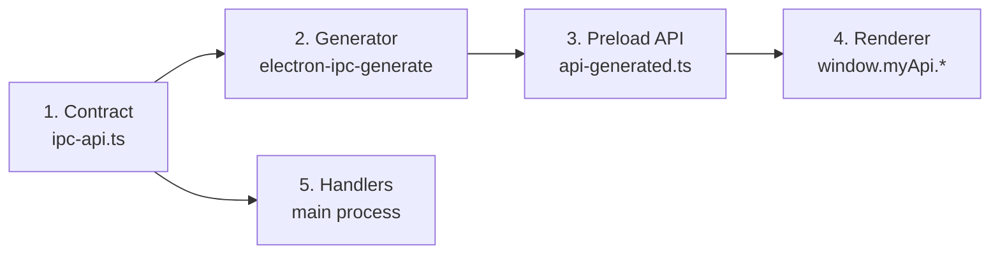

# Quick Start

Get your first type-safe IPC call running in **under 5 minutes**.

## 1. Install

::: code-group

```bash [pnpm]
pnpm add @number10/electron-ipc
pnpm add yaml
```

```bash [npm]
npm install @number10/electron-ipc
npm install yaml
```

:::

## 2. Define a Contract

Create `src/main/ipc-api.ts`:

```typescript
import {
  GenericInvokeContract,
  IInvokeContract,
  GenericRendererEventContract,
  IRendererEventContract,
} from '@number10/electron-ipc'

// Request/response: renderer asks, main answers
export type InvokeContracts = GenericInvokeContract<{
  AddNumbers: IInvokeContract<{ a: number; b: number }, number>
  GetAppVersion: IInvokeContract<void, string>
}>

// Fire-and-forget: renderer sends, main handles
export type EventContracts = GenericRendererEventContract<{
  Quit: IRendererEventContract<void>
}>
```

## 3. Create Config

Create `ipc-config.yaml` in your project root:

```yaml
apis:
  - name: myApi
    input: ./src/main/ipc-api.ts
    output: ./src/preload/api-generated.ts
    contracts:
      invoke: InvokeContracts
      event: EventContracts
```

Add the generate script to `package.json`:

```json
{
  "scripts": {
    "generate": "electron-ipc-generate --config=./ipc-config.yaml"
  }
}
```

## 4. Generate the API

```bash
pnpm run generate
```

This creates `src/preload/api-generated.ts` with fully typed IPC wrappers.

## 5. Expose in Preload

Edit `src/preload/index.ts`:

```typescript
import { exposeMyApi, MyApiType } from './api-generated'

declare global {
  interface Window {
    myApi: MyApiType
  }
}

exposeMyApi()
```

## 6. Register Handlers in Main

Edit your main process entry (e.g. `src/main/index.ts`):

```typescript
import { app } from 'electron'
import { AbstractRegisterHandler, AbstractRegisterEvent } from '@number10/electron-ipc'
import type { InvokeContracts, EventContracts } from './ipc-api'

class RegisterHandler extends AbstractRegisterHandler {
  handlers = {
    AddNumbers: async (_event, { a, b }) => a + b,
    GetAppVersion: async () => app.getVersion(),
  } as const satisfies AbstractRegisterHandler['handlers']
}

class RegisterEvent extends AbstractRegisterEvent {
  events = {
    Quit: () => app.quit(),
  } as const satisfies AbstractRegisterEvent['events']
}

RegisterHandler.register()
RegisterEvent.register()
```

::: tip Type-Safe Handlers
The `as const satisfies` pattern gives you full autocomplete and type-checking on handler names and parameters. If you later rename a contract, TypeScript flags the mismatch immediately.
:::

## 7. Call from Renderer

In any renderer file:

```typescript
// Invoke: call main and get a response
const sum = await window.myApi.invokeAddNumbers({ a: 5, b: 3 })
console.log(sum) // 8

const version = await window.myApi.invokeGetAppVersion()
console.log(version) // "1.0.0"

// Event: send to main (no response expected)
window.myApi.sendQuit()
```

## What Just Happened?



1. You defined contracts → the single source of truth
2. The generator created typed APIs for preload and main
3. The preload exposes `window.myApi` via `contextBridge`
4. The renderer calls typed methods with autocomplete
5. The main process handles them with typed parameters

## Next Steps

- See all five IPC patterns in [Overview](./overview)
- Understand the architecture in [Architecture](./architecture)
- Add runtime validation → [Validation](./validation)
- Set up React hooks → enable `reactHooksOutput` in your YAML config
- Debug with the [IPC Inspector](./inspector)
