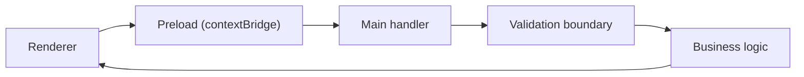
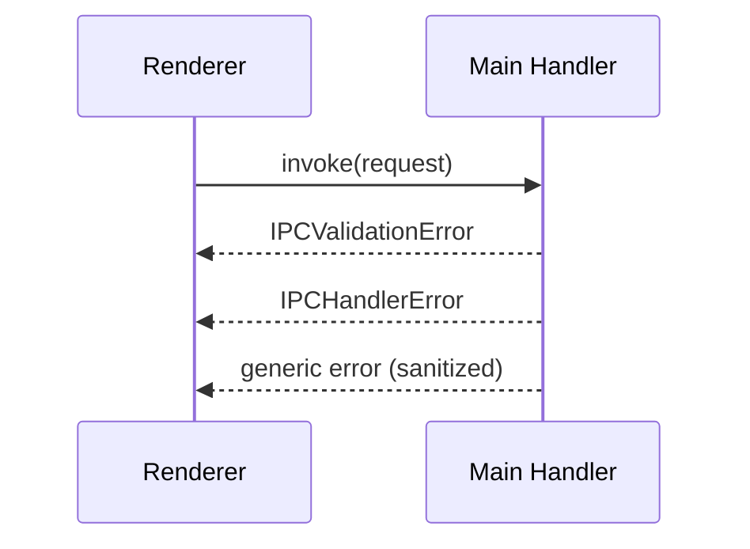

# Security & Best Practices

Production-ready guide for secure and maintainable Electron IPC applications.

## Security Fundamentals

### Context Isolation (Critical)

**Always enable context isolation** in your BrowserWindow:

```typescript
const mainWindow = new BrowserWindow({
  webPreferences: {
    preload: path.join(__dirname, '../preload/index.js'),
    contextIsolation: true, // ✅ REQUIRED
    nodeIntegration: false, // ✅ REQUIRED
    sandbox: true, // ✅ Recommended for renderer security
  },
})
```

**Why:** Context isolation prevents renderer processes from accessing Node.js APIs directly,
limiting attack surface if malicious code runs in renderer.

### Content Security Policy (CSP)

Add CSP meta tag to your HTML:

```html
<meta
  http-equiv="Content-Security-Policy"
  content="default-src 'self'; 
           script-src 'self'; 
           style-src 'self' 'unsafe-inline'; 
           img-src 'self' data: https:; 
           font-src 'self' data:; 
           connect-src 'self';"
/>
```

**Why:** CSP prevents XSS attacks by restricting resource loading and script execution.

### Input Validation

**Always validate IPC payloads in main process:**



```typescript
import { zodAdapter } from '@number10/electron-ipc/validation'
import { z } from 'zod'

// Define strict schemas
const saveFileSchema = z.object({
  path: z.string().min(1).max(500),
  content: z.string().max(10_000_000), // 10MB limit
})

const handler = withInvokeValidation(
  { request: zodAdapter.zodValidator(saveFileSchema) },
  async (_event, { path, content }) => {
    // Validate path doesn't escape allowed directories
    const normalizedPath = path.normalize(path)
    if (!normalizedPath.startsWith(allowedBaseDir)) {
      throw new IPCHandlerError('Invalid path', { code: 'PATH_TRAVERSAL' })
    }

    await fs.writeFile(normalizedPath, content)
  }
)
```

**Key points:**

- Never trust renderer input
- Validate data types, lengths, and formats
- Check for path traversal attacks
- Sanitize file paths and URLs

### Principle of Least Privilege

**Only expose necessary APIs to renderer:**

```typescript
// ❌ Bad: Exposing too much
contextBridge.exposeInMainWorld('api', {
  readFile: (path) => fs.readFileSync(path),
  exec: (cmd) => child_process.execSync(cmd), // DANGEROUS!
})

// ✅ Good: Controlled, specific APIs
contextBridge.exposeInMainWorld('api', {
  loadUserSettings: () => /* controlled read */,
  saveUserSettings: (settings) => /* validated write */,
})
```

### Remote Content

**Never load untrusted remote content without sandboxing:**

```typescript
// ❌ Dangerous
const webview = new BrowserWindow({
  webPreferences: {
    nodeIntegration: true, // NEVER with remote content
  },
})
webview.loadURL('https://untrusted-site.com')

// ✅ Safe
const webview = new BrowserWindow({
  webPreferences: {
    sandbox: true,
    contextIsolation: true,
    nodeIntegration: false,
    webSecurity: true,
  },
})
webview.loadURL('https://external-site.com')
```

## Error Handling Best Practices

### Standardized Error Responses

Use consistent error structures:



```typescript
import { IPCHandlerError, IPCValidationError } from '@number10/electron-ipc/validation'

// In main process
async function handler(_event, request) {
  try {
    // Validation errors (automatic with validators)
    const validated = validate(request)

    // Business logic errors
    const result = await doSomething(validated)
    if (!result) {
      throw new IPCHandlerError('Resource not found', {
        code: 'NOT_FOUND',
        statusCode: 404,
      })
    }

    return result
  } catch (error) {
    // Transform unknown errors
    if (error instanceof IPCValidationError || error instanceof IPCHandlerError) {
      throw error
    }

    // Log internal errors, don't expose details
    console.error('Internal error:', error)
    throw new IPCHandlerError('Internal server error', {
      code: 'INTERNAL_ERROR',
      statusCode: 500,
    })
  }
}
```

### Renderer Error Handling

**Automatic Error Deserialization:**

When errors are thrown in main process handlers, they're serialized for IPC transmission. Use `deserializeError()` to reconstruct proper error instances:

```typescript
import {
  deserializeError,
  isIPCValidationError,
  isIPCHandlerError,
} from '@number10/electron-ipc/validation'

try {
  const result = await window.api.invokeGetUser(userId)
} catch (err) {
  // Deserialize error to get proper IPCValidationError/IPCHandlerError instances
  const error = deserializeError(err)

  if (isIPCValidationError(error)) {
    // Show user-friendly validation errors
    showValidationErrors(error.issues)

    // Log detailed issues
    error.issues.forEach((issue) => {
      console.error(`${issue.path.join('.')}: ${issue.message}`)
    })
  } else if (isIPCHandlerError(error)) {
    // Handle business logic errors
    if (error.code === 'NOT_FOUND') {
      showNotification('User not found')
    } else if (error.statusCode === 403) {
      showNotification('Permission denied')
    } else {
      showNotification('Request failed')
    }
  } else {
    // Unexpected errors
    console.error('Unexpected error:', error)
    showNotification('An unexpected error occurred')
  }
}
```

**Wrapper for Automatic Deserialization:**

```typescript
import { withErrorDeserialization } from '@number10/electron-ipc/validation'

// Wrap IPC calls for automatic error deserialization
const safeInvoke = withErrorDeserialization(async (userId: number) =>
  window.api.invokeGetUser(userId)
)

try {
  const result = await safeInvoke(123)
} catch (error) {
  // Error is automatically deserialized
  if (isIPCValidationError(error)) {
    console.log('Validation failed:', error.issues)
  }
}
```

### Stream Error Handling

```typescript
// Renderer
window.api.downloadLargeFile(
  { fileId: '123' },
  (chunk) => processChunk(chunk),
  () => console.log('Download complete'),
  (error) => {
    // Always handle stream errors
    if (isIPCHandlerError(error)) {
      showError(`Download failed: ${error.message}`)
    } else {
      showError('Download interrupted')
    }
  },
  { signal: abortController.signal } // Allow cancellation
)
```

## Performance Best Practices

### Minimize IPC Calls

```typescript
// ❌ Bad: Multiple round-trips
const user = await window.api.invokeGetUser(id)
const posts = await window.api.invokeGetPosts(id)
const comments = await window.api.invokeGetComments(id)

// ✅ Good: Single call
const userData = await window.api.invokeGetUserData(id)
// Returns { user, posts, comments }
```

### Use Streams for Large Data

```typescript
// ❌ Bad: Loading entire file into memory
const largeFile = await window.api.invokeReadFile('huge.dat') // OOM risk

// ✅ Good: Stream large data
window.api.downloadFile(
  { path: 'huge.dat' },
  (chunk) => {
    // Process chunk-by-chunk
    processChunk(chunk)
  },
  () => console.log('Complete')
)
```

### Debounce User Input

```typescript
import { debounce } from 'lodash-es'

// ❌ Bad: IPC on every keystroke
<input onChange={(e) => window.api.sendSearch(e.target.value)} />

// ✅ Good: Debounced IPC
const debouncedSearch = debounce(
  (query) => window.api.sendSearch(query),
  300
)

<input onChange={(e) => debouncedSearch(e.target.value)} />
```

### Batch Operations

```typescript
// ❌ Bad: Individual calls
for (const item of items) {
  await window.api.invokeSaveItem(item)
}

// ✅ Good: Batch processing
await window.api.invokeSaveBatch(items)
```

## Multi-Window Patterns

### Window Registry

Use the Window Manager for centralized window tracking:

```typescript
import { WindowRegistry } from '@number10/electron-ipc/window-manager'

// Register windows with roles
const mainWindow = new BrowserWindow(/*...*/)
WindowRegistry.add(mainWindow, 'main')

const settingsWindow = new BrowserWindow(/*...*/)
WindowRegistry.add(settingsWindow, 'settings')

// Broadcast to specific roles
import { mainBroadcast } from './broadcast-generated'
import { WindowRegistry } from '@number10/electron-ipc/window-manager'

// To all windows
WindowRegistry.getAll().forEach((win) => {
  mainBroadcast.UpdateStatus(win, { status: 'ready' })
})

// To specific role
const mainWindows = WindowRegistry.getByRole('main')
mainWindows.forEach((win) => {
  mainBroadcast.Refresh(win)
})
```

### Window Communication

```typescript
// Renderer A → Main → Renderer B
// Renderer A
await window.api.invokeNotifyOtherWindow({ targetRole: 'settings', message: 'refresh' })

// Main process
class RegisterHandler extends AbstractRegisterHandler {
  handlers: IPCHandlerType<InvokeContracts> = {
    NotifyOtherWindow: async (_event, { targetRole, message }) => {
      const targetWindows = WindowRegistry.getByRole(targetRole)
      targetWindows.forEach((win) => {
        mainBroadcast.Notification(win, { message })
      })
    },
  }
}
```

## Production Deployment

### Environment-Specific Configuration

```typescript
// config.ts
const isDev = !app.isPackaged

export const config = {
  inspector: {
    enabled: isDev, // Only in development
    openOnStart: false,
  },
  tracing: {
    enabled: isDev,
    payloadMode: isDev ? 'full' : 'none',
  },
  logging: {
    level: isDev ? 'debug' : 'error',
  },
}
```

### Secure Packaging

```json
{
  "build": {
    "asar": true,
    "asarUnpack": ["**/*.node"],
    "files": ["dist/**/*", "!dist/**/*.map", "!**/*.ts", "!**/*.md"]
  }
}
```

### Auto-Update Security

```typescript
import { autoUpdater } from 'electron-updater'

// Verify signatures
autoUpdater.checkForUpdatesAndNotify({
  title: 'Update Available',
  body: 'A new version is available',
})

// Use HTTPS for update server
autoUpdater.setFeedURL({
  provider: 'github',
  owner: 'your-org',
  repo: 'your-repo',
  private: false,
})
```

## Monitoring & Debugging

### Use IPC Inspector (Development Only)

```typescript
// Only in development
if (!app.isPackaged) {
  enableInspector({
    enabled: true,
    openOnStart: true,
    shortcut: 'CommandOrControl+Shift+I',
  })
}
```

### Structured Logging

```typescript
import winston from 'winston'

const logger = winston.createLogger({
  level: process.env.LOG_LEVEL || 'info',
  format: winston.format.json(),
  transports: [
    new winston.transports.File({ filename: 'error.log', level: 'error' }),
    new winston.transports.File({ filename: 'combined.log' }),
  ],
})

// Log IPC errors
class RegisterHandler extends AbstractRegisterHandler {
  handlers: IPCHandlerType<InvokeContracts> = {
    SaveFile: async (_event, request) => {
      try {
        await saveFile(request)
        logger.info('File saved', { path: request.path })
      } catch (error) {
        logger.error('Save failed', { path: request.path, error })
        throw new IPCHandlerError('Save failed', { code: 'SAVE_ERROR' })
      }
    },
  }
}
```

## Testing

### Unit Tests

```typescript
import { describe, it, expect } from 'vitest'
import { zodAdapter } from '@number10/electron-ipc/validation'
import { z } from 'zod'

describe('SaveFile handler', () => {
  it('validates path format', () => {
    const schema = z.object({
      path: z.string().min(1),
      content: z.string(),
    })

    const validator = zodAdapter.zodValidator(schema)

    const result = validator({ path: '', content: 'test' })
    expect(result.success).toBe(false)
  })
})
```

### Integration Tests

```typescript
// Test IPC flows
import { ipcMain, ipcRenderer } from 'electron'
import { expect, test } from '@playwright/test'

test('save file workflow', async () => {
  // Simulate IPC call
  const result = await ipcRenderer.invoke('SaveFile', {
    path: '/test.txt',
    content: 'Hello',
  })

  expect(result).toBe(true)
})
```

## Common Security Pitfalls

### ❌ Don't Trust Renderer Input

```typescript
// ❌ Dangerous
ipcMain.handle('runCommand', async (_event, command) => {
  return exec(command) // NEVER!
})

// ✅ Safe
ipcMain.handle('exportData', async (_event, format) => {
  if (!['json', 'csv'].includes(format)) {
    throw new Error('Invalid format')
  }
  return exportData(format)
})
```

### ❌ Don't Expose File System Directly

```typescript
// ❌ Dangerous
ipcMain.handle('readFile', async (_event, path) => {
  return fs.readFileSync(path) // Path traversal risk!
})

// ✅ Safe
const ALLOWED_DIR = app.getPath('userData')

ipcMain.handle('readUserFile', async (_event, filename) => {
  const safePath = path.join(ALLOWED_DIR, path.basename(filename))
  if (!safePath.startsWith(ALLOWED_DIR)) {
    throw new Error('Invalid path')
  }
  return fs.readFileSync(safePath)
})
```

### ❌ Don't Serialize Sensitive Data

```typescript
// ❌ Bad
const user = await database.getUser(id)
return user // May contain password hash, tokens, etc.

// ✅ Good
const user = await database.getUser(id)
return {
  id: user.id,
  name: user.name,
  email: user.email,
  // Omit sensitive fields
}
```

## Checklist

Before deploying to production:

- [ ] Context isolation enabled
- [ ] Node integration disabled
- [ ] CSP headers configured
- [ ] All IPC handlers have input validation
- [ ] Error handling doesn't leak sensitive info
- [ ] File path operations sanitized
- [ ] No shell command execution from renderer
- [ ] Auto-update uses HTTPS and signature verification
- [ ] Development tools (Inspector) disabled in production
- [ ] Logging configured (no sensitive data)
- [ ] Asar packaging enabled
- [ ] Code signing configured
- [ ] Update mechanisms tested
- [ ] Security audit completed

## Resources

- [Electron Security Checklist](https://www.electronjs.org/docs/latest/tutorial/security)
- [OWASP Desktop App Security](https://owasp.org/www-project-desktop-app-security-top-10/)
- [Electron Hardening Guide](https://github.com/doyensec/electronegativity)

## See Also

- [Validation Guide](./validation.md) - Runtime validation setup
- [Inspector Guide](./inspector.md) - Debugging IPC flows
- [Window Manager](./window-manager.md) - Multi-window management
