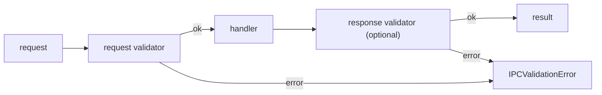
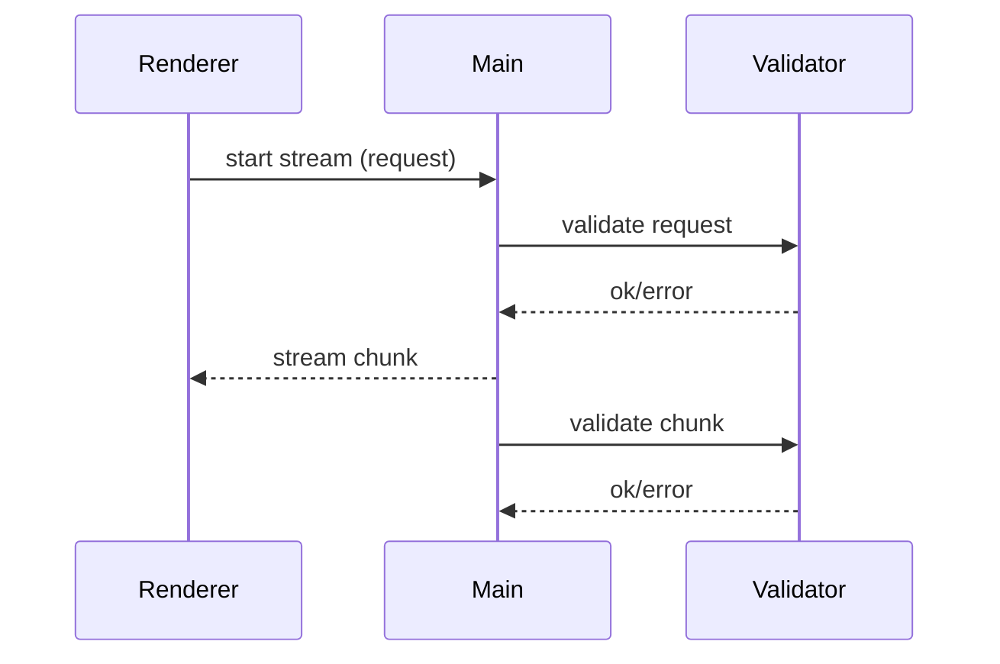

# Runtime Validation

The validation system provides type-safe runtime validation for IPC contracts with standardized error handling. It supports popular validation libraries (Zod, Valibot) and allows custom validators.

## Overview

**When to use validation:**

- Production applications requiring input sanitization
- APIs exposed to untrusted renderer processes
- Streaming data that needs per-chunk validation
- Complex data structures requiring deep validation

**Features:**

- ✅ Adapter-based design (Zod, Valibot, custom)
- ✅ Standardized error types for IPC
- ✅ Stream chunk validation
- ✅ Backward compatible with existing code
- ✅ Zero dependencies (adapters are optional)

## Quick Start

### With Zod

```bash
pnpm add zod
```

```typescript
import { z } from 'zod'
import { zodAdapter } from '@number10/electron-ipc/validation'
import { defineInvokeHandlers } from '@number10/electron-ipc'
import type { InvokeContracts } from './ipc-api'

// Define schemas
const addNumbersRequestSchema = z.object({
  a: z.number(),
  b: z.number(),
})

const addNumbersResponseSchema = z.number()

// Create validators
const requestValidator = zodAdapter.zodValidator(addNumbersRequestSchema)
const responseValidator = zodAdapter.zodValidator(addNumbersResponseSchema)

// Use in handler
import { withInvokeValidation } from '@number10/electron-ipc/validation'

const handlers = defineInvokeHandlers<InvokeContracts>({
  AddNumbers: withInvokeValidation(
    { request: requestValidator, response: responseValidator },
    async (_event, { a, b }) => a + b
  ),
})
```

### With Valibot

```bash
pnpm add valibot
```

```typescript
import { number, object, safeParse } from 'valibot'
import { valibotAdapter } from '@number10/electron-ipc/validation'
import { withInvokeValidation } from '@number10/electron-ipc/validation'

// Define schemas
const addNumbersRequestSchema = object({
  a: number(),
  b: number(),
})

const addNumbersResponseSchema = number()

// Create validators (pass safeParse explicitly)
const requestValidator = valibotAdapter.valibotValidator(addNumbersRequestSchema, safeParse)
const responseValidator = valibotAdapter.valibotValidator(addNumbersResponseSchema, safeParse)

// Use in handler (same as Zod)
const handlers = defineInvokeHandlers<InvokeContracts>({
  AddNumbers: withInvokeValidation(
    { request: requestValidator, response: responseValidator },
    async (_event, { a, b }) => a + b
  ),
})
```

## Validation Helpers

### Invoke Contracts

Validate both request and response:



```typescript
import { withInvokeValidation } from '@number10/electron-ipc/validation'

const handler = withInvokeValidation(
  {
    request: requestValidator,
    response: responseValidator, // Optional
  },
  async (_event, req) => {
    // Handler receives validated request
    return processRequest(req)
  }
)
```

### Event Contracts

Validate event payloads:

```typescript
import { withEventValidation } from '@number10/electron-ipc/validation'

const handler = withEventValidation(payloadValidator, (_event, payload) => {
  // Handler receives validated payload
  console.log(payload)
})
```

### Stream Contracts

#### Stream Invoke

Validate request and each chunk:



```typescript
import { withStreamInvokeValidation } from '@number10/electron-ipc/validation'

const handler = withStreamInvokeValidation(
  {
    request: requestValidator,
    data: chunkValidator, // Optional
  },
  (_event, req) => {
    // Return stream - chunks are validated automatically
    return createDataStream(req)
  }
)
```

#### Stream Download

```typescript
import { withStreamDownloadValidation } from '@number10/electron-ipc/validation'

const handler = withStreamDownloadValidation(
  {
    request: requestValidator,
    data: chunkValidator,
  },
  (req, _event) => {
    return createDownloadStream(req)
  }
)
```

#### Stream Upload

```typescript
import { withStreamUploadValidation } from '@number10/electron-ipc/validation'

const handler = withStreamUploadValidation(
  {
    request: requestValidator,
    data: chunkValidator,
  },
  (req, onData, onEnd, onError) => {
    onData((chunk) => {
      // Receive validated chunks
      processChunk(chunk)
    })
    onEnd(() => console.log('Upload complete'))
    onError((err) => console.error('Upload failed:', err))
  }
)
```

## Error Handling

### Standardized Errors

The validation system provides two standardized error types:

#### IPCValidationError

Thrown when validation fails:

```typescript
import { IPCValidationError, isIPCValidationError } from '@number10/electron-ipc/validation'

try {
  await window.api.invokeAddNumbers({ a: 'invalid', b: 5 })
} catch (error) {
  if (isIPCValidationError(error)) {
    console.log('Validation failed:', error.message)
    console.log('Issues:', error.issues)
    // Issues: [
    //   {
    //     path: ['a'],
    //     message: 'Expected number, received string',
    //     expected: 'number',
    //     received: 'string'
    //   }
    // ]
  }
}
```

#### IPCHandlerError

For handler execution errors:

```typescript
import { IPCHandlerError } from '@number10/electron-ipc/validation'

// In handler
throw new IPCHandlerError('Database unavailable', {
  code: 'DB_CONNECTION_FAILED',
  statusCode: 503,
  details: { retryAfter: 5000 },
})
```

### Error Formatting

```typescript
import { formatValidationIssues } from '@number10/electron-ipc/validation'

if (isIPCValidationError(error)) {
  const formatted = formatValidationIssues(error.issues)
  console.log(formatted)
  // Output:
  //   - user.name: Required
  //   - user.age: Invalid (expected: number) (received: string)
}
```

## Custom Validators

Create validators without external libraries:

```typescript
import type { Validator } from '@number10/electron-ipc/validation'
import { IPCValidationError } from '@number10/electron-ipc/validation'

const emailValidator: Validator<string> = (input) => {
  if (typeof input !== 'string') {
    return {
      success: false,
      error: new IPCValidationError('Expected string', [
        { path: [], message: 'Expected string', expected: 'string', received: typeof input },
      ]),
    }
  }

  if (!/^[^\s@]+@[^\s@]+\.[^\s@]+$/.test(input)) {
    return {
      success: false,
      error: new IPCValidationError('Invalid email', [
        { path: [], message: 'Invalid email format' },
      ]),
    }
  }

  return { success: true, data: input }
}
```

### Adapting SafeParse Functions

Use `validatorFromSafeParse` for libraries with safeParse-style APIs:

```typescript
import { validatorFromSafeParse } from '@number10/electron-ipc/validation'
import { z } from 'zod'

// Manual adapter (use zodAdapter instead in practice)
const schema = z.number()
const validator = validatorFromSafeParse(schema.safeParse.bind(schema))
```

## Migration Guide

### From Old Validation System

The old validation helpers in `interfaces/validation.ts` are deprecated but still work:

```typescript
// Old (still works, but deprecated)
import { validatorFromSafeParse, withInvokeValidation } from '@number10/electron-ipc'

// New (recommended)
import { validatorFromSafeParse, withInvokeValidation } from '@number10/electron-ipc/validation'

// Or use adapters
import { zodAdapter } from '@number10/electron-ipc/validation'
const validator = zodAdapter.zodValidator(schema)
```

**Changes:**

- ✅ API is identical - just change import paths
- ✅ New standardized error types (IPCValidationError, IPCHandlerError)
- ✅ Better tree-shaking (validation code not bundled unless used)
- ✅ Adapters for Zod/Valibot with proper error transformation

**Breaking changes:** None (old exports still work)

## Best Practices

### 1. Validate at Boundaries

```typescript
// ✅ Good: Validate at IPC boundary
const handler = withInvokeValidation({ request: validator }, async (_event, req) => {
  return processData(req) // req is validated
})

// ❌ Avoid: Manual validation inside handler
const handler = async (_event, req) => {
  if (typeof req.id !== 'number') throw new Error('Invalid')
  return processData(req)
}
```

### 2. Response Validation Optional

```typescript
// Response validation is optional but recommended for critical data
const handler = withInvokeValidation(
  {
    request: requestValidator,
    response: responseValidator, // Ensures handler returns correct type
  },
  async (_event, req) => processRequest(req)
)
```

### 3. Stream Chunk Validation

```typescript
// Validate each chunk for security
const handler = withStreamUploadValidation(
  {
    request: requestValidator,
    data: chunkValidator, // Validates every chunk
  },
  (req, onData, onEnd, onError) => {
    onData((chunk) => {
      // chunk is guaranteed to be valid
      writeToFile(chunk)
    })
  }
)
```

### 4. Error Handling in Renderer

**Automatic Error Deserialization:**

Errors thrown in main process handlers are serialized for IPC transmission. Use `deserializeError()` to reconstruct proper error instances:

```typescript
import {
  deserializeError,
  isIPCValidationError,
  formatValidationIssues,
} from '@number10/electron-ipc/validation'

try {
  const result = await window.api.invokeAddNumbers({ a, b })
} catch (err) {
  // Deserialize error to get proper IPCValidationError instance
  const error = deserializeError(err)

  if (isIPCValidationError(error)) {
    // Show user-friendly validation errors
    showError(`Invalid input:\n${formatValidationIssues(error.issues)}`)

    // Access structured error details
    error.issues.forEach((issue) => {
      console.error(`${issue.path.join('.')}: ${issue.message}`)
    })
  } else {
    // Handle other errors
    showError('Request failed')
  }
}
```

**Wrapper for Automatic Deserialization:**

For convenience, wrap IPC calls with `withErrorDeserialization()`:

```typescript
import { withErrorDeserialization } from '@number10/electron-ipc/validation'

// Create wrapped version of API call
const safeAddNumbers = withErrorDeserialization(async (params: { a: number; b: number }) =>
  window.api.invokeAddNumbers(params)
)

try {
  const result = await safeAddNumbers({ a: 1, b: 2 })
} catch (error) {
  // Error is automatically deserialized
  if (isIPCValidationError(error)) {
    console.log('Validation failed:', error.issues)
  }
}
```

## Examples

See example implementations in the repository:

- `apps/test-app/src/main/index.ts` - Zod validation with invoke/stream handlers
- `packages/template-basic` - Basic template with optional validation

## API Reference

### Validators

- `zodAdapter.zodValidator<T>(schema: ZodType<T>): Validator<T>`
- `valibotAdapter.valibotValidator<T>(schema: BaseSchema<T>, safeParse): Validator<T>`
- `validatorFromSafeParse<T>(safeParse, toError?): Validator<T>`

### Helpers

- `withInvokeValidation<TReq, TRes>(validators, handler)`
- `withEventValidation<TReq>(validator, handler)`
- `withStreamInvokeValidation<TReq, TData>(validators, handler)`
- `withStreamDownloadValidation<TReq, TData>(validators, handler)`
- `withStreamUploadValidation<TReq, TData>(validators, handler)`
- `ensureValid<T>(validator, input): T`

### Error Types

- `IPCValidationError` - Validation failure with detailed issues
- `IPCHandlerError` - Handler execution error with code/statusCode
- `isIPCValidationError(error): boolean`
- `isIPCHandlerError(error): boolean`
- `formatValidationIssues(issues): string`
- `deserializeError(error): Error` - Deserialize errors from IPC
- `withErrorDeserialization<TArgs, TResult>(fn): (...args: TArgs) => Promise<TResult>` - Wrapper for automatic error deserialization

### Types

- `Validator<T>` - Validation function type
- `ValidationResult<T>` - Result type (success/failure)
- `ValidationIssue` - Single validation error detail
- `InvokeValidationOptions<TReq, TRes>` - Options for invoke validation
- `StreamValidationOptions<TReq, TData>` - Options for stream validation
