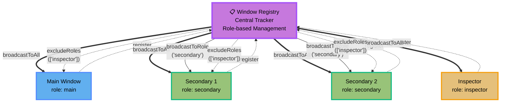

# Window Management

Multi-Window support for Electron applications with role-based organization and enhanced broadcast APIs.

## Overview

The Window Management module provides a centralized registry for BrowserWindows with role-based organization, automatic lifecycle tracking, and enhanced broadcast APIs for multi-window applications.

## Features

- **Central Registry**: Track all BrowserWindows in one place
- **Role-Based Organization**: Categorize windows (main, secondary, inspector, custom)
- **Automatic Cleanup**: Auto-unregister on window close
- **Focus Tracking**: Track when windows are focused
- **Enhanced Broadcasts**: Send messages to all windows or filtered by role
- **Helper Functions**: Convenient helpers for common tasks

### Architecture Overview



The window-manager module is included in `@number10/electron-ipc`:

```bash
npm install @number10/electron-ipc
```

Import from subpath:

```typescript
import { getWindowRegistry, createBroadcastToAll } from '@number10/electron-ipc/window-manager'
```

## Basic Usage

### 1. Register Windows

```typescript
import { app, BrowserWindow } from 'electron'
import { getWindowRegistry } from '@number10/electron-ipc/window-manager'

function createMainWindow() {
  const mainWindow = new BrowserWindow({
    /* ... */
  })

  // Register as main window
  getWindowRegistry().register(mainWindow, 'main')

  return mainWindow
}

function createSecondaryWindow() {
  const secondaryWindow = new BrowserWindow({
    /* ... */
  })

  // Register as secondary
  getWindowRegistry().register(secondaryWindow, 'secondary')

  return secondaryWindow
}
```

### 2. Broadcast to All Windows

```typescript
import { createBroadcastToAll } from '@number10/electron-ipc/window-manager'
import type { BroadcastContracts } from './ipc-api'

const broadcastAll = createBroadcastToAll<BroadcastContracts>()

// Send to all windows
broadcastAll('StatusUpdate', { status: 'ready' })

// Exclude specific roles
broadcastAll(
  'StatusUpdate',
  { status: 'ready' },
  {
    excludeRoles: ['inspector'],
  }
)
```

### 3. Broadcast to Specific Role

```typescript
import { createBroadcastToRole } from '@number10/electron-ipc/window-manager'

const broadcastToMain = createBroadcastToRole<BroadcastContracts>('main')

// Only to main windows
broadcastToMain('AppUpdate', { version: '2.0.0' })
```

### 4. Use Helper Functions

```typescript
import {
  getMainWindow,
  getAllAppWindows,
  getWindowFromEvent,
  getWindowRoleFromEvent,
} from '@number10/electron-ipc/window-manager'

// Get main window
const mainWindow = getMainWindow()

// Get all app windows (excludes inspector by default)
const windows = getAllAppWindows()

// In IPC handler
ipcMain.handle('some-channel', (event) => {
  const window = getWindowFromEvent(event)
  const role = getWindowRoleFromEvent(event)
  console.log(`Request from ${role} window`)
})
```

## API Reference

### WindowRegistry

Central registry for all BrowserWindows.

#### Methods

- `register(window: BrowserWindow, role?: string)`: Register a window (default role: 'secondary')
- `unregister(windowId: number)`: Manually unregister a window
- `getAll()`: Get all active windows (excludes destroyed)
- `getByRole(role: string)`: Get windows filtered by role
- `getById(id: number)`: Get window by ID
- `getMain()`: Get main window (or first registered window)
- `count(excludeInspector?: boolean)`: Count active windows

#### Example

```typescript
const registry = getWindowRegistry()

// Register
registry.register(myWindow, 'main')

// Query
const allWindows = registry.getAll()
const mainWindow = registry.getMain()
const secondaries = registry.getByRole('secondary')
const count = registry.count() // excludes inspector by default
```

### createBroadcastToAll()

Creates a broadcast function that sends to **all** registered windows.

```typescript
function createBroadcastToAll<T>(): BroadcastFunction<T>
```

#### Parameters

- `channel`: Channel name from contract
- `payload`: Payload data
- `options?`: `{ excludeRoles?: string[] }` - Roles to exclude

#### Example

```typescript
const broadcast = createBroadcastToAll<BroadcastContracts>()

broadcast('Ping', 42)
broadcast('Ping', 42, { excludeRoles: ['inspector', 'secondary'] })
```

### createBroadcastToRole()

Creates a broadcast function for a specific role.

```typescript
function createBroadcastToRole<T>(role: string): BroadcastFunction<T>
```

#### Example

```typescript
const broadcastToMain = createBroadcastToRole<BroadcastContracts>('main')
const broadcastToSecondary = createBroadcastToRole<BroadcastContracts>('secondary')

broadcastToMain('Update', { data: 'main only' })
broadcastToSecondary('Notification', { message: 'secondaries only' })
```

### broadcastToApp()

Convenience helper that broadcasts to all windows **except inspector**.

```typescript
const broadcast = broadcastToApp<BroadcastContracts>()
broadcast('AppStatus', { ready: true }) // inspector windows don't receive this
```

### Helper Functions

#### getWindowFromEvent()

Extract BrowserWindow from IPC event.

```typescript
function getWindowFromEvent(event: IpcMainEvent | IpcMainInvokeEvent): BrowserWindow | null
```

#### getWindowRoleFromEvent()

Get window role from IPC event.

```typescript
function getWindowRoleFromEvent(event: IpcMainEvent | IpcMainInvokeEvent): string | undefined
```

#### getMainWindow()

Get main window reference.

```typescript
function getMainWindow(): BrowserWindow | null
```

#### getAllAppWindows()

Get all app windows (excluding inspector by default).

```typescript
function getAllAppWindows(excludeInspector?: boolean): BrowserWindow[]
```

## Window Roles

Built-in roles:

- `'main'`: Primary application window
- `'secondary'`: Additional app windows
- `'inspector'`: IPC Inspector window (when using inspector feature)
- Custom: Any string you define

```typescript
registry.register(window, 'settings-dialog')
registry.register(window, 'preview')
```

## Lifecycle Management

### Automatic Cleanup

Windows are automatically unregistered when closed:

```typescript
// No manual cleanup needed!
window.on('closed', () => {
  // Registry already cleaned up via auto-registered listener
})
```

### Manual Cleanup

If needed:

```typescript
registry.unregister(window.id)
```

### Destroyed Windows

The registry automatically filters out destroyed windows:

```typescript
// Always returns only active windows
const active = registry.getAll()
```

## Best Practices

### 1. Register Early

Register windows immediately after creation:

```typescript
function createWindow() {
  const window = new BrowserWindow({
    /* ... */
  })
  getWindowRegistry().register(window, 'main') // ← Register first

  window.loadFile('index.html')
  return window
}
```

### 2. Use Roles Consistently

Define role constants:

```typescript
const WindowRole = {
  MAIN: 'main',
  SETTINGS: 'settings',
  PREVIEW: 'preview',
} as const

registry.register(window, WindowRole.SETTINGS)
```

### 3. Exclude Inspector

Always exclude inspector from app broadcasts:

```typescript
broadcastAll('AppData', data, { excludeRoles: ['inspector'] })

// Or use helper
const broadcast = broadcastToApp<BroadcastContracts>()
broadcast('AppData', data)
```

### 4. Check Window Existence

Before window-specific operations:

```typescript
const mainWindow = getMainWindow()
if (mainWindow && !mainWindow.isDestroyed()) {
  // Safe to use
}
```

## Migration from Old API

### Before (old API)

```typescript
const broadcast = createBroadcast<BroadcastContracts>()
broadcast('Ping', mainWindow, payload)
```

### After (new API)

```typescript
// Option 1: Broadcast to all
const broadcastAll = createBroadcastToAll<BroadcastContracts>()
broadcastAll('Ping', payload)

// Option 2: Still use old API (fully backward compatible)
const broadcast = createBroadcast<BroadcastContracts>()
broadcast('Ping', mainWindow, payload) // ← Still works!
```

## TypeScript Support

Full type safety with contract types:

```typescript
type BroadcastContracts = GenericBroadcastContract<{
  Ping: { payload: number }
  Status: { payload: { ready: boolean } }
  Empty: { payload: void }
}>

const broadcast = createBroadcastToAll<BroadcastContracts>()

broadcast('Ping', 42) // ✅ OK
broadcast('Ping', 'invalid') // ❌ Type error
broadcast('Status', { ready: true }) // ✅ OK
broadcast('Empty') // ✅ OK (void payload)
```

## Examples

See the example apps for complete working implementations:

**Multi-Window Demo:**

- `apps/multi-window` - Dedicated multi-window IPC demo with role-based broadcasts
- `apps/test-app/src/main/index.ts` - Multi-window setup with menu and registry integration

Both apps demonstrate:

- Window menu with "Open Secondary Window" command
- Registry info logging
- Broadcast to all windows
- Role-based window management

## Testing

The registry can be reset for testing:

```typescript
import { resetWindowRegistry } from '@number10/electron-ipc/window-manager'

beforeEach(() => {
  resetWindowRegistry()
})
```

## Compatibility

- **Fully backward compatible**: Old broadcast API still works
- **Opt-in**: Only needed for multi-window apps
- **Zero overhead**: No performance impact when not used
- **TypeScript strict mode**: Fully typed

## Related

- [IPC Inspector](./inspector.md) - Uses Window Management for multi-window tracing
- [Overview](/guide/overview) - Library overview
