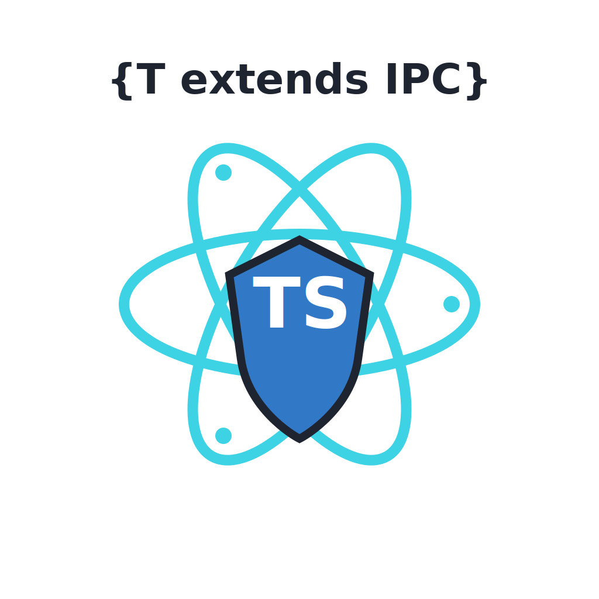

# @number10/electron-ipc

<p align="center">
  
</p>

TypeScript code generator for type-safe Electron IPC communication with streaming support.

[](https://www.npmjs.com/package/@number10/electron-ipc)
[](https://opensource.org/licenses/MIT)

## Overview

This library provides a code generation approach to create type-safe IPC communication between Electron's main and renderer processes. It supports traditional request/response patterns, events, broadcasts, and streaming for large data transfers.

## Features

- ✅ **Type-Safe Communication**: Full TypeScript support with compile-time type checking
- ✅ **Four Communication Patterns**: Invoke, Event, Broadcast, and Streaming
- ✅ **Streaming Support**: Handle large data transfers efficiently using Web Streams API
- ✅ **React Hooks**: Automatic generation of React hooks for all contract types
- ✅ **YAML Configuration**: Clean, maintainable configuration for multiple APIs
- ✅ **Cross-Platform**: Full support for Windows, macOS, and Linux
- ✅ **Zero Runtime Overhead**: All type safety at compile time

## Installation

```bash
npm install @number10/electron-ipc
```

## Quick Start

Here's a minimal example to get you started:

```typescript
// 1. Define contracts (src/main/ipc-api.ts)
import { GenericInvokeContract, GenericEventContract } from '@number10/electron-ipc'

export type InvokeContracts = GenericInvokeContract<{
  AddNumbers: IInvokeContract<{ a: number; b: number }, number>
}>

export type EventContracts = GenericEventContract<{
  LogMessage: IEventContract<string>
}>
```

```yaml
# 2. Create configuration file (ipc-config.yaml)
apis:
  - name: myApi
    input: ./src/main/ipc-api.ts
    output: ./src/preload/api-generated.ts
    reactHooksOutput: ./src/preload/api-hooks.ts # Optional
    contracts:
      invoke: InvokeContracts
      event: EventContracts
```

```bash
# 3. Generate API
npx electron-ipc-generate --config=./ipc-config.yaml
```

```typescript
// 4. Use in renderer
const result = await window.myApi.invokeAddNumbers({ a: 1, b: 2 })
window.myApi.sendLogMessage('Hello from renderer!')
```

```typescript
// 5. Handle in main process
import {
  AbstractRegisterHandler,
  AbstractRegisterEvent,
  IPCHandlerType,
  IPCEventType,
} from 'electron-ipc'
import { InvokeContracts, EventContracts } from './ipc-api'

class RegisterHandler extends AbstractRegisterHandler {
  handlers: IPCHandlerType<InvokeContracts> = {
    AddNumbers: async (_event, params) => params.a + params.b,
  }
}

class RegisterEvent extends AbstractRegisterEvent {
  events: IPCEventType<EventContracts> = {
    LogMessage: (_event, message) => console.log(message),
  }
}

RegisterHandler.register()
RegisterEvent.register()
```

## Communication Patterns

electron-ipc supports four main communication patterns:

### 1. Define IPC Contracts

Create a TypeScript file defining your IPC contracts (e.g., `src/main/ipc-api.ts`):

```typescript
import {
  GenericInvokeContract,
  GenericRendererEventContract,
  GenericBroadcastContract,
  GenericStreamInvokeContract,
  GenericStreamUploadContract,
  GenericStreamDownloadContract,
} from '@number10/electron-ipc'

export type InvokeContracts = GenericInvokeContract<{
  AddNumbers: IInvokeContract<{ a: number; b: number }, number>
  GetAppInfo: IInvokeContract<void, { name: string; version: string }>
}>

export type EventContracts = GenericRendererEventContract<{
  Quit: IRendererEventContract<void>
  LogMessage: IRendererEventContract<{ level: 'info' | 'warn' | 'error'; message: string }>
}>

export type BroadcastContracts = GenericBroadcastContract<{
  Ping: IBroadcastContract<number>
  About: IBroadcastContract<void>
}>

export type StreamInvokeContracts = GenericStreamInvokeContract<{
  GetLargeData: IStreamInvokeContract<{ offset: number }, string>
}>

export type StreamUploadContracts = GenericStreamUploadContract<{
  UploadFile: IStreamUploadContract<{ filename: string }, Uint8Array>
}>

export type StreamDownloadContracts = GenericStreamDownloadContract<{
  DownloadLogs: IStreamDownloadContract<{ since: Date }, string>
}>
```

### 2. Create Configuration File

Create a YAML configuration file (e.g., `ipc-config.yaml`) to define your API generation settings:

```yaml
apis:
  - name: myApi
    input: ./src/main/ipc-api.ts
    output: ./src/preload/api-generated.ts
    contracts:
      invoke: InvokeContracts
      event: EventContracts
      send: BroadcastContracts

  # You can define multiple APIs in the same file
  - name: streamApi
    input: ./src/main/ipc-api-stream.ts
    output: ./src/preload/stream-api-generated.ts
    contracts:
      streamInvoke: StreamInvokeContracts
      streamUpload: StreamUploadContracts
      streamDownload: StreamDownloadContracts
```

### 3. Generate API Code

Run the generator with your configuration file:

```bash
npx electron-ipc-generate --config=./ipc-config.yaml
```

### 4. Setup Preload Script

In your preload script (e.g., `src/preload/index.ts`), expose the generated API to the renderer process:

```typescript
import { exposeMyApi, MyApiType } from './api-generated'

declare global {
  interface Window {
    myApi: MyApiType
  }
}

exposeMyApi()
```

The `exposeMyApi()` function uses Electron's `contextBridge` to securely expose the type-safe API to the renderer process. The `MyApiType` provides full TypeScript IntelliSense for `window.myApi`.

### 5. Use in Renderer

### 5. Use in Renderer

The API is now available in the renderer process with full type safety:

````typescript
```typescript
// Invoke methods (request-response)
const result = await window.myApi.invokeAddNumbers({ a: 1, b: 2 })

// Send events (fire-and-forget)
window.myApi.sendLogMessage({ level: 'info', message: 'Hello!' })

// Listen to broadcasts
window.myApi.onPing((count) => console.log('Ping:', count))

// Stream invoke (request with streaming response)
const stream = await window.myApi.invokeStreamGetLargeData({ offset: 0 })
const reader = stream.getReader()
while (true) {
  const { done, value } = await reader.read()
  if (done) break
  console.log('Received:', value)
````

// Stream upload (upload data to main)
const uploadStream = window.myApi.uploadStreamUploadFile({ filename: 'data.txt' })
const writer = uploadStream.getWriter()
await writer.write(new Uint8Array([1, 2, 3, 4, 5]))
await writer.close()

// Stream download (receive stream from main)
const downloadStream = window.myApi.downloadStreamDownloadLogs({ since: new Date() })
const downloadReader = downloadStream.getReader()
while (true) {
const { done, value } = await downloadReader.read()
if (done) break
console.log('Log:', value)
}

````

### 6. Handle in Main Process

Implement handlers for invoke contracts, events, and streams in your main process (e.g., `src/main/index.ts`):

```typescript
import {
  AbstractRegisterHandler,
  AbstractRegisterEvent,
  AbstractRegisterStreamHandler,
  AbstractRegisterStreamUpload,
  AbstractRegisterStreamDownload,
  IPCHandlerType,
  IPCEventType,
} from '@number10/electron-ipc'
import {
  InvokeContracts,
  EventContracts,
  StreamInvokeContracts,
  StreamUploadContracts,
  StreamDownloadContracts,
} from './ipc-api'

// Implement invoke handlers (request-response)
class RegisterHandler extends AbstractRegisterHandler {
  handlers: IPCHandlerType<InvokeContracts> = {
    AddNumbers: async (_event, params) => {
      return params.a + params.b
    },
    GetAppInfo: async () => {
      return {
        name: app.getName(),
        version: app.getVersion(),
      }
    },
  }
}

// Implement event handlers (renderer → main)
class RegisterEvent extends AbstractRegisterEvent {
  events: IPCEventType<EventContracts> = {
    Quit: () => {
      app.quit()
    },
    LogMessage: (_event, payload) => {
      if (payload.level === 'error') console.error(payload.message)
      else if (payload.level === 'warn') console.warn(payload.message)
      else console.log(payload.message)
    },
  }
}

// Implement stream invoke handlers (request with streaming response)
class RegisterStreamHandler extends AbstractRegisterStreamHandler {
  handlers: IPCStreamHandlerType<StreamInvokeContracts> = {
    GetLargeData: async (_event, { offset }) => {
      // Return a ReadableStream
      return createReadableStreamFromLargeData(offset)
    },
  }
}

// Implement stream upload handlers (renderer → main)
class RegisterStreamUpload extends AbstractRegisterStreamUpload {
  handlers: IPCStreamUploadHandlerType<StreamUploadContracts> = {
    UploadFile: async (_event, { filename }, stream) => {
      // Handle the uploaded stream
      const reader = stream.getReader()
      const chunks = []
      while (true) {
        const { done, value } = await reader.read()
        if (done) break
        chunks.push(value)
      }
      // Process uploaded data...
    },
  }
}

// Implement stream download handlers (main → renderer)
class RegisterStreamDownload extends AbstractRegisterStreamDownload {
  handlers: IPCStreamDownloadHandlerType<StreamDownloadContracts> = {
    DownloadLogs: async (_event, { since }) => {
      // Return a ReadableStream for logs
      return createLogStream(since)
    },
  }
}

// Register all handlers and events
RegisterHandler.register()
RegisterEvent.register()
RegisterStreamHandler.register()
RegisterStreamUpload.register()
RegisterStreamDownload.register()
````

**Sending broadcasts from main to renderer:**

Use the generated broadcast API to send events to the renderer process:

```typescript
import { mainBroadcast } from './broadcast-generated'

// Send broadcasts to specific window
mainBroadcast.Ping(mainWindow, 42)
mainBroadcast.About(mainWindow)
```

The generated `mainBroadcast` object provides type-safe methods for each broadcast contract. Each method takes the target `BrowserWindow` as the first parameter, followed by the payload (if any).

## Configuration

### YAML Configuration File

The recommended way to configure the generator is using a YAML configuration file. This provides a clean, maintainable way to manage multiple APIs and their settings.

#### Basic Configuration

```yaml
# ipc-config.yaml
apis:
  - name: myApi
    input: ./src/main/ipc-api.ts
    output: ./src/preload/api-generated.ts
    contracts:
      invoke: InvokeContracts
      event: EventContracts
```

#### Full Configuration Example

```yaml
# ipc-config.yaml
# $schema: ./node_modules/@number10/electron-ipc/ipc-config.schema.json  # For IntelliSense

apis:
  # Main API with standard contracts
  - name: api
    input: ./src/main/ipc-api.ts
    output: ./src/preload/api-generated.ts
    reactHooksOutput: ./src/renderer/hooks/api-hooks.ts # Optional React hooks
    mainBroadcastOutput: ./src/main/broadcast-generated.ts # Optional main broadcast API
    tsconfig: ./tsconfig.json # Optional: for path aliases/re-exports
    contracts:
      invoke: InvokeContracts # Request-response pattern
      event: EventContracts # Renderer → Main events
      send: BroadcastContracts # Main → Renderer broadcasts

  # Stream API for large data transfer
  - name: streamApi
    input: ./src/main/ipc-api-stream.ts
    output: ./src/preload/stream-api-generated.ts
    contracts:
      streamInvoke: StreamInvokeContracts # Request with streaming response
      streamUpload: StreamUploadContracts # Upload stream from renderer
      streamDownload: StreamDownloadContracts # Download stream to renderer
```

#### Configuration Schema

Each API definition supports the following properties:

| Property                   | Type   | Required | Description                                        |
| -------------------------- | ------ | -------- | -------------------------------------------------- |
| `name`                     | string | ✅       | Name of the API (used for `expose{Name}` function) |
| `input`                    | string | ✅       | Path to TypeScript file with IPC contracts         |
| `output`                   | string | ✅       | Output path for generated API code                 |
| `reactHooksOutput`         | string | ❌       | Optional path for generated React hooks            |
| `mainBroadcastOutput`      | string | ❌       | Optional path for main broadcast API               |
| `tsconfig`                 | string | ❌       | Optional tsconfig path for path aliases/re-exports |
| `contracts`                | object | ✅       | Contract type mappings (at least one required)     |
| `contracts.invoke`         | string | ❌       | Type name for invoke contracts                     |
| `contracts.event`          | string | ❌       | Type name for event contracts                      |
| `contracts.send`           | string | ❌       | Type name for broadcast contracts                  |
| `contracts.streamInvoke`   | string | ❌       | Type name for stream invoke contracts              |
| `contracts.streamUpload`   | string | ❌       | Type name for stream upload contracts              |
| `contracts.streamDownload` | string | ❌       | Type name for stream download contracts            |

#### Usage

```bash
# Generate all APIs defined in the config file
npx electron-ipc-generate --config=./ipc-config.yaml
```

#### IntelliSense Support

Add the JSON schema reference to your YAML file for IntelliSense in VS Code:

```yaml
$schema: ./node_modules/@number10/electron-ipc/ipc-config.schema.json

apis:
  - name: api
    # ... IntelliSense will provide auto-completion here
```

## Features

✅ **Full Type Safety** - Compile-time validation across all IPC communication  
✅ **Auto-Generated API** - No manual IPC boilerplate code required  
✅ **IntelliSense Support** - Auto-completion in all processes (main, preload, renderer)  
✅ **Four Communication Patterns** - Invoke (request-response), Events (fire-and-forget), Broadcasts (main → renderer), Streams (large data/real-time)  
✅ **Context Bridge Integration** - Secure IPC through Electron's `contextBridge`  
✅ **TypeScript Strict Mode** - Designed for maximum type safety  
✅ **YAML Configuration** - Clean, maintainable multi-API setup  
✅ **React Hooks Generation** - Optional React hooks for seamless integration

## Documentation

For detailed documentation, architecture, and advanced usage, see:

- [📚 Complete Documentation](https://github.com/Michael--/electron-ipc/tree/main/docs) - Comprehensive guide with examples and best practices
- [🏗️ Architecture Guide](https://github.com/Michael--/electron-ipc/blob/main/docs/ARCHITECTURE.md) - Technical details about the code generator design

## Migration from v1.x

### Breaking Changes

**1. YAML Configuration Required**

CLI arguments are no longer supported. Create a YAML configuration file:

```yaml
# ipc-config.yaml
apis:
  - name: myApi
    input: ./src/main/ipc-api.ts
    output: ./src/preload/generated-api.ts
    contracts:
      invoke: InvokeContracts
      event: EventContracts
```

Then run:

```bash
npx electron-ipc-generate --config=./ipc-config.yaml
```

**2. React Hooks Integration**

The separate `electron-ipc-react` package has been removed. React hooks are now generated via:

```yaml
apis:
  - name: myApi
    # ... other config
    reactHooksOutput: ./src/hooks/api-hooks.ts # Add this line
```

**3. Import Path Updates**

Contract types are now re-exported from generated files. Update imports:

```typescript
// Old
import { InvokeContracts } from './ipc-api'

// New (optional, both work)
import { InvokeContracts } from './generated-api'
```

### New Features in v2.0

- ✅ **Streaming Contracts**: Handle large files and real-time data
- ✅ **Automatic React Hooks**: Generate hooks for all contract types
- ✅ **Windows Support**: Full cross-platform compatibility
- ✅ **Multiple APIs**: Define multiple API configurations in one YAML file

## Assets

This package includes logo assets for branding and documentation:

- `assets/logo-light.svg` - Light theme logo (transparent background)
- `assets/logo-dark.svg` - Dark theme logo (dark background)

Both logos are available in SVG format and can be used in documentation, websites, or any other branding materials.

## License

MIT
